<p align="center">
  
  <h1 align="center">Airbnb Snowflake dbt Pipeline & Semantic Intelligence Platform</h1>
  <p align="center">
    <strong>Enterprise Medallion Data Engineering • MetricFlow Semantic Layer • MLOps & Model Registry • Real-Time Serving</strong>
  </p>
  <p align="center">
    <a href="https://github.com/jimaaa17/airbnb-snowflake-dbt-pipeline/actions/workflows/dbt_ci_cd.yml"></a>
    <a href="https://github.com/jimaaa17/airbnb-snowflake-dbt-pipeline/actions/workflows/ml_and_apps_ci_cd.yml"></a>
    
    
    
    
    
    
  </p>
</p>

---

## 📌 Project Overview

This platform is a production-grade data intelligence ecosystem for Airbnb marketplace analytics and predictive operations. It ingests raw event data from **AWS S3** into **Snowflake**, models transformations through a **dbt Medallion Architecture**, enforces enterprise metric consistency via the **dbt Semantic Layer (MetricFlow)**, automates **MLOps lifecycle tracking and model registry** with **MLflow**, and serves insights through **FastAPI microservices** and an interactive **Streamlit Analytics Studio**.

---

## 🏗️ Architecture & Multimodal Serving Flow

The platform is designed across four decoupled, governed operational planes:

```mermaid
flowchart LR
    %% Subgraph 1: Data Engineering Plane
    subgraph DEP["1. Data Engineering Plane (Snowflake + dbt)"]
        direction TB
        S3["☁️ AWS S3<br/>Raw Event CSVs"] -->|"COPY INTO"| STG["❄️ AIRBNB.staging<br/>External Staging Tables"]
        STG -->|"Watermark Filter"| BRZ["🥉 AIRBNB.bronze<br/>Raw Incremental Append"]
        BRZ -->|"Jinja Macros & Dedup"| SLV["🥈 AIRBNB.silver<br/>Clean Business Models"]
        SLV -->|"Denormalize"| OBT["🥇 AIRBNB.gold.obt<br/>One Big Table Mart"]
        SLV -->|"SCD Type 2"| DIM["🥇 AIRBNB.gold.dim_*<br/>Dimension Snapshots"]
        OBT & DIM --> FACTS["🥇 AIRBNB.gold.facts<br/>Dimensional Fact Table"]
    end

    %% Subgraph 2: Semantic & Feature Store Plane
    subgraph GOV["2. Governance & Feature Store"]
        direction TB
        OBT --> MF["📐 dbt MetricFlow<br/>Certified Semantic Models<br/>(Metrics as Code)"]
        OBT --> FS["⚡ Zipline Feature Store<br/>As-Of Sliding Windows<br/>(Zero Lookahead Bias)"]
    end

    %% Subgraph 3: MLOps & Explainability Plane
    subgraph MLOPS["3. MLOps & Explainability Engine"]
        direction TB
        FS --> TRN["🤖 Scikit-Learn Pipelines<br/>• Dynamic Price Regressor<br/>• Cancellation Classifier"]
        TRN --> GATE["🛡️ Automated CI Gate<br/>eval_gate.py SLA Check"]
        GATE --> REG["📦 MLflow Model Registry<br/>Centralized Tracking (:5001)<br/>Tagged @champion"]
        REG --> SHAP["🔍 SHAP TreeExplainer<br/>• Global Feature Attribution<br/>• Underpriced Cohort Drivers"]
    end

    %% Subgraph 4: Consumption & Serving Plane
    subgraph SERVE["4. Serving & Consumption Surfaces"]
        direction TB
        MF --> API["🚀 FastAPI Gateway (:8000)<br/>• Governed Metric Endpoints<br/>• Real-Time Scoring Microservice<br/>• Dockerized Inference"]
        REG --> API
        MF & REG & SHAP --> APP["📊 Airbnb Analytics Studio (:8502)<br/>• Executive KPIs & Diagnostic RCA<br/>• Self-Service Metric Explorer<br/>• Predictive Studio & SHAP"]
    end

    DEP --> GOV
    GOV --> MLOPS
    MLOPS --> SERVE

    classDef blue fill:#EBF8FF,stroke:#3182CE,stroke-width:1.5px,color:#2B6CB0;
    classDef purple fill:#FAF5FF,stroke:#805AD5,stroke-width:1.5px,color:#553C9A;
    classDef green fill:#F0FFF4,stroke:#38A169,stroke-width:1.5px,color:#22543D;
    classDef coral fill:#FFF5F5,stroke:#E53E3E,stroke-width:1.5px,color:#742A2A;

    class S3,STG,BRZ,SLV,OBT,DIM,FACTS blue;
    class MF,FS purple;
    class TRN,GATE,REG,SHAP green;
    class API,APP coral;
```



### Architectural Planes & Key Responsibilities

| Plane | Core Technologies | Primary Responsibilities | Core Deliverables & SLAs |
| :--- | :--- | :--- | :--- |
| **1. Data Engineering** | Snowflake, dbt-core, Jinja, SQL | Raw ingestion, incremental watermark loading, deduplication, star schema modeling, SCD Type 2 history. | `AIRBNB.staging`, `bronze`, `silver`, `gold.obt`, `gold.facts`, `dim_*`. 82/82 passing dbt tests. |
| **2. Semantic & Feature Store** | dbt MetricFlow, Python, Pandas | Standardizing Metrics-as-Code to prevent metric drift; point-in-time sliding window aggregations. | `semantic_models.yml` (SSOT), 30-day point-in-time Zipline features with zero lookahead bias. |
| **3. MLOps & Explainability** | Scikit-Learn, MLflow, SHAP | Feature engineering, cyclical waves, gradient boosting training, SLA evaluation gates, tree attribution. | Dynamic Price Regressor ($R^2=0.9483$), Cancellation Classifier ($F_1=0.7412$), MLflow Model Registry (`@champion`), SHAP diagnostics. |
| **4. Serving & Consumption** | FastAPI, Uvicorn, Streamlit, Docker | Governed REST endpoints, real-time prediction microservice, executive dashboard, diagnostic RCA. | Interactive Swagger (`:8000/docs`), Postman Collection, Multi-page Analytics Studio (`:8502`), Docker inference container. |

---

## ✅ Completed Milestones

1. **Modern Python & Tooling Environment**:
   - Managed via Astral **`uv`** on Python 3.12 with deterministic lockfiles.
   - Core libraries: `dbt-core`, `dbt-snowflake`, `fastapi`, `uvicorn`, `streamlit`, `scikit-learn`, `joblib`.
2. **Snowflake Custom Schema Control**:
   - Custom `generate_schema_name` macro ensures exact schema names (`bronze`, `silver`, `gold`) without default target prefixes.
3. **Bronze Layer Ingestion**:
   - Incremental watermark models for `bronze_listings`, `bronze_bookings`, and `bronze_hosts` filtering on `CREATED_AT`.
4. **Silver Layer Cleansing & Business Macros**:
   - Standardized Jinja macros: `multiply` (rounded arithmetic), `tag` (price tier classification), `trimmer` (whitespace sanitization).
   - Merge deduplication on primary keys (`unique_key`).
5. **Gold Marts (One Big Table & SCD Type 2 Star Schema)**:
   - Denormalized wide table `obt` joining bookings, listings, and hosts with **zero fan-out guarantees**.
   - SCD Type 2 dimension snapshots (`dim_bookings`, `dim_listings`, `dim_hosts`) using active sentinel dates (`to_date('9999-12-31')`).
   - Dimensional fact table `facts` joining core transactions to dimension snapshots.
6. **Data Quality & Ingestion Guardrails**:
   - Gatekeeper tests in `tests/source_tests.sql` auditing raw S3 ingestion.
   - Cross-layer reconciliation tests verifying `COUNT(bronze) == COUNT(silver) == COUNT(obt)`. 82 of 82 dbt tests passing in CI/CD.
7. **CI/CD Automation via GitHub Actions**:
   - Pull request validation workflows running `dbt compile` and `dbt test`.
   - Production deployment pipeline running `dbt snapshot` and `dbt build`.
8. **dbt Semantic Layer / MetricFlow Implementation**:
   - Standardized semantic models in [`semantic_models.yml`](airbnb_snowflake_dbt_pipeline/models/gold/semantic_models.yml) eliminating cross-team "Metric Drift".
9. **FastAPI Semantic Gateway**:
   - High-throughput REST microservices at `http://localhost:8000` with Swagger docs (`/docs`) and complete Postman collection.
10. **Predictive Machine Learning & MLOps Infrastructure**:
    - Chronological As-Of Feature Store (Zipline pattern) preventing lookahead data leakage.
    - Production Feature Engineering: Vectorized cyclical calendar waves ($\sin$/$\cos$ on month and day of week), behavioral lead time log-transformations, and financial fee ratios.
    - Gradient Boosting Dynamic Price Regressor ($R^2 = 0.9483$, MAPE $10.34\%$) and Cancellation Risk Classifier ($F_1 = 0.74$, PR-AUC $0.78$).
    - Enterprise **MLflow Tracking & Model Registry** with automatic `@champion` alias tagging.
    - **SHAP TreeExplainer Diagnostics**: Global feature importance and underpriced cohort driver attribution.
    - **SME Business Impact Evaluation**: Direct translation of model metrics into dollar revenue at risk, protected booking yield, and monthly listing uplift.
    - Automated CI/CD evaluation gatekeeper script ([`ml/evaluation/eval_gate.py`](ml/evaluation/eval_gate.py)).
11. **Airbnb Analytics Studio (Streamlit Data App)**:
    - Enterprise BI application at `http://localhost:8502` adhering to Airbnb's corporate design language.
    - Embedded SHAP feature importance charts, underpriced cohort gap analyses, and SME financial cards inside the Predictive Studio.

---

## 🛡️ Governed Semantic Metrics (SSOT)

All metrics queried through the API or viewed in the Analytics Studio are certified against governed business logic:

| Metric Identifier | Display Name | Certified Formula | Accountable Owner | Business Tier |
| :--- | :--- | :--- | :--- | :--- |
| `total_revenue` | Gross Bookings Revenue | `SUM(TOTAL_AMOUNT)` | Finance & Strategy | Tier-1 Executive KPI |
| `booking_conversion_rate` | Booking Conversion Rate | `COUNT(confirmed) / COUNT(total) * 100` | Product Growth | Tier-1 Executive KPI |
| `average_booking_value` | Average Booking Value (ABV) | `SUM(TOTAL_AMOUNT) / COUNT(BOOKING_ID)` | Commercial Operations | Tier-1 Commercial |
| `cancellation_rate` | Cancellation Rate | `COUNT(cancelled) / COUNT(total) * 100` | Trust & Safety Operations | Risk & Operations |
| `total_bookings` | Total Reservations Volume | `COUNT(BOOKING_ID)` | Global Operations | Tier-2 Operational |
| `active_listings_count` | Available Supply Count | `COUNT(DISTINCT LISTING_ID)` | Supply & Host Growth | Supply Health |

---

## 🤖 Predictive Machine Learning & Feature Engineering Architecture

Modeled after **Airbnb's Zipline Feature Store**, the predictive subsystem transforms historical Gold mart records into point-in-time training snapshots, production scikit-learn pipelines, and real-time inference microservices.

### 1. Production Feature Engineering Pipeline (`AirbnbFeatureEngineer`)

All raw transactional and listing fields are transformed through [`ml/features/transformers.py`](ml/features/transformers.py) within an encapsulated, serializable scikit-learn pipeline:

* **Temporal & Cyclical Waves**:
  * `arrival_month_sin` & `arrival_month_cos`: 12-month annual cyclical wave ($\sin(2\pi(m-1)/12)$, $\cos(2\pi(m-1)/12)$) resolving the December-to-January circular boundary cliff.
  * `arrival_dow_sin` & `arrival_dow_cos`: 7-day weekly cyclical wave ($\sin(2\pi \cdot \text{dow}/7)$, $\cos(2\pi \cdot \text{dow}/7)$) capturing weekly check-in cadence.
  * `is_weekend_arrival`: Binary indicator (1 for Friday/Saturday arrivals) isolating leisure vacation check-ins.
* **Lead-Time Dynamics & Behavioral Bucketing**:
  * `lead_time_days`: Sub-day midnight normalized lead time clipped to `[0, 730]` days to prevent same-day floor-division integer bugs.
  * `lead_time_log`: Variance-stabilizing `ln(1 + lead_time_days)` transformation dampening extreme right-skew.
  * Behavioral bins: `is_last_minute` ($\le 3$ days), `is_short_notice` ($4-7$ days), `is_far_advance` ($\ge 45$ days).
  * Data audit flags: `lead_time_missing` and `lead_time_invalid` (flags retroactive bookings).
* **Financial Proportions & Relative Fee Burdens**:
  * `cleaning_fee_ratio` = `CLEANING_FEE / TOTAL_AMOUNT` bounded `[0.0, 1.0]`.
  * `service_fee_ratio` = `SERVICE_FEE / TOTAL_AMOUNT` bounded `[0.0, 1.0]`.
  * Defensive division guards: masks negative/zero totals, flags `total_amount_invalid`.
* **Supply Capacity & Relative Density**:
  * `bedroom_to_accommodates_ratio` = `BEDROOMS / ACCOMMODATES`.
  * `cleaning_fee_per_bedroom` = `CLEANING_FEE / BEDROOMS`.
  * `cleaning_fee_per_accommodate` = `CLEANING_FEE / ACCOMMODATES`.
  * `price_per_accommodate` = `PRICE_PER_NIGHT / ACCOMMODATES` (strictly isolated to cancellation propensity to prevent target leakage in pricing).
* **Point-in-Time Historical As-Of Features (Zipline)**:
  * `trailing_30d_listing_bookings`, `trailing_30d_listing_cancellations`, and `trailing_30d_cancellation_rate` computed strictly prior to observation timestamp (`t < curr_time`) with zero lookahead bias.

### 2. Predictive Models & SME Impact Evaluation

| Model | Architecture | Technical Performance | SME Business Impact Metrics |
| :--- | :--- | :--- | :--- |
| **Dynamic Price Regressor** | Gradient Boosting Regressor (`max_depth=5`, `n_estimators=150`) | **$R^2 = 0.9483$**<br/>**$\text{MAPE} = 10.34\%$**<br/>$\text{MAE} = \$20.54$ | • **Underpriced Listings**: 19.3% leaving money on the table<br/>• **Est. Monthly Uplift**: +$42.50 / listing<br/>• **Guardrail Compliance**: 72.0% within ±10% fair market rate |
| **Cancellation Classifier** | Stratified Gradient Boosting Classifier (`threshold=0.35`) | **ROC-AUC = 0.8124**<br/>**PR-AUC = 0.7780**<br/>**$F_1 = 0.7412$** | • **Revenue at Risk**: $24,150 evaluated<br/>• **Revenue Protected**: $18,350 (76.0% capture)<br/>• **Avg. Warning Lead**: 34 days advance notice for host rebooking |

### 3. MLflow Model Registry & Lifecycle Management
* Centralized SQLite tracking backend (`sqlite:///ml/mlruns.db`) logging parameters, metrics, and pipeline artifacts.
* Automated promotion to **MLflow Model Registry** with `@champion` alias tagging for zero-downtime serving.

### 4. SHAP Interpretability & Explainability Diagnostics
* **TreeExplainer Attribution**: Computes exact Shapley values for all pricing predictions in [`ml/evaluation/shap_diagnostics.py`](ml/evaluation/shap_diagnostics.py).
* **Global Importance**: Identifies top structural price drivers (`ACCOMMODATES`, `ROOM_TYPE`, `CITY`, `BATHROOMS`).
* **Underpriced Cohort Diagnosis**: Quantifies which features push fair market value *above* the host's listed rate, empowering hosts with actionable pricing recommendations.

### 5. Automated CI/CD Quality Gate (`eval_gate.py`)
Retraining pipelines enforce automated quality gates before serializing artifacts or promoting registry models:
* Regression Gate: $R^2 \ge 0.85$ and $\text{MAPE} \le 20.0\%$
* Classification Gate: Accuracy $\ge 60.0\%$ and ROC-AUC $\ge 0.70$

---

## 💻 Airbnb Analytics Studio (Streamlit App)

The Analytics Studio (`apps/semantic_bi_app.py`) provides a modular enterprise user interface across 5 distinct operational workspaces:

1. **📈 Executive Overview**: High-level financial KPIs, YoY deltas, and geographic performance cards.
2. **🔬 Diagnostic RCA & A/B Engine**: Multi-dimensional variance attribution and two-sample Z-test statistical significance calculator.
3. **⚡ Self-Service Metric Explorer**: Slice and dice governed metrics with zero raw SQL writing and inspected MetricFlow queries.
4. **🎯 Predictive ML Studio**: Interactive night-rate estimator with yield guardrails and reservation cancellation risk scorer.
5. **📚 Catalog & Lineage Hub**: Certified metric ownership directory, dbt test monitor (82/82 passing), and interactive Medallion DAG.

---

## 📂 Project Directory Structure

```text
Airbnb Snowflake DBT Pipeline/
├── pyproject.toml                                # Project metadata and dependencies (Astral uv)
├── uv.lock                                       # Deterministic dependency lockfile
├── Dockerfile.inference                          # Production inference microservice container
├── .gitignore                                    # Credentials, venvs, and artifacts exclusion
├── README.md                                     # Production documentation & architectural specs
│
├── .github/workflows/                            # Decoupled CI/CD automation pipelines
│   ├── dbt_ci_cd.yml                             # Snowflake dbt build, snapshot & data quality tests
│   └── ml_and_apps_ci_cd.yml                     # ML training, SLA gate, pytest, API smoke & Docker
│
├── airbnb_snowflake_dbt_pipeline/                # Core dbt transformation project
│   ├── dbt_project.yml                           # dbt project configuration & schema mapping
│   ├── macros/                                   # Jinja transformation macros
│   │   ├── generate_schema_name.sql              # Clean bronze/silver/gold schema routing
│   │   ├── multiply.sql                          # Precision multiplication macro
│   │   ├── tag.sql                               # Price tier bucketing macro
│   │   └── trim.sql                              # Whitespace trimming macro
│   ├── models/
│   │   ├── sources/sources.yml                   # Raw staging source definitions
│   │   ├── bronze/                               # Incremental bronze models (watermark filtered)
│   │   ├── silver/                               # Standardized silver models (deduped & cleansed)
│   │   └── gold/                                 # Gold marts: OBT, facts, and semantic_models.yml
│   ├── snapshots/                                # SCD Type 2 dimension snapshots (dim_*)
│   └── tests/                                    # Gatekeeper and reconciliation data tests
│
├── semantic_api/                                 # FastAPI Semantic Gateway
│   ├── main.py                                   # REST API endpoints & MetricFlow query router
│   └── airbnb_semantic_layer_postman_collection.json # Automated Postman test suite
│
├── ml/                                           # Predictive Intelligence & MLOps Platform
│   ├── configs/                                  # Declarative model & feature hyperparameters
│   ├── data/                                     # Snowflake connector & dataset loaders
│   ├── features/                                 # Feature store, cyclical transformers, registry
│   │   ├── feature_store.py                      # Zipline point-in-time as-of sliding windows
│   │   ├── transformers.py                       # Cyclical waves, lead-time & ratio transformers
│   │   └── definitions.py                        # Centralized feature registry metadata
│   ├── models/                                   # Gradient Boosting regression & classification
│   ├── evaluation/                               # Evaluation SLA gates, SHAP attribution, SME metrics
│   │   ├── eval_gate.py                          # Automated CI/CD performance quality gate
│   │   ├── shap_diagnostics.py                   # TreeExplainer feature attribution & cohort drivers
│   │   └── metrics.py                            # Technical & SME financial impact metrics
│   ├── tracking/                                 # MLflow tracking & Model Registry manager
│   │   └── tracker.py                            # SQLite backend & @champion alias staging
│   ├── inference/                                # Real-time & batch inference engines
│   │   ├── service.py                            # FastAPI-integrated prediction service
│   │   └── batch_predictor.py                    # Scalable batch scoring pipeline
│   ├── tests/                                    # Pytest unit, regression & zero-leakage tests
│   ├── train_all.py                              # Master training pipeline & registry promotion
│   └── run_shap_analysis.py                      # CLI tool generating SHAP explanation plots
│
├── apps/                                         # Airbnb Analytics Studio (Streamlit Data App)
│   ├── semantic_bi_app.py                        # Main multi-page navigation shell
│   ├── components/                               # Reusable UI components, header & Airbnb theme
│   ├── assets/                                   # Official Airbnb Bélo vector & branding
│   └── views/                                    # 5 dedicated workspace modules
│       ├── executive_overview.py                 # Executive financial KPIs & YoY performance
│       ├── diagnostic_rca.py                     # Multi-dimensional RCA & A/B hypothesis test
│       ├── metric_explorer.py                    # Self-service slice & dice MetricFlow explorer
│       ├── predictive_studio.py                  # Dynamic pricing, cancellation risk & SHAP
│       └── catalog_hub.py                        # Metric ownership directory & dbt test monitor
│
└── docs/                                         # Architectural reports & enterprise roadmaps
    ├── SEMANTIC_ARCHITECTURE_AND_ML_REPORT.md    # SME architectural guide & workflows
    └── semantic_layer_and_predictive_roadmap.md  # Engineering roadmap & design patterns
```

---

## 📐 Engineering & Data Science Best Practices

This repository is built following enterprise standards for data engineering, MLOps, and production software design:

1. **Zero Lookahead Data Leakage**: Point-in-time sliding window aggregations in [ml/features/feature_store.py](ml/features/feature_store.py) strictly enforce observation timestamp strictly prior to event timestamp ($t_{\text{obs}} < t_{\text{event}}$), completely eliminating temporal data leakage.
2. **Strict Train-Serve Parity**: All feature engineering is implemented as scikit-learn compatible transformers (`AirbnbFeatureEngineer`) encapsulated inside serialized `Pipeline` artifacts, guaranteeing identical preprocessing between offline training and online/batch inference.
3. **Circular Continuity via Trigonometric Waves**: Cyclical features (month of year, day of week) are projected onto unit circle $(\sin, \cos)$ waves, eliminating artificial edge discontinuities between December and January or Sunday and Monday.
4. **Governed Metrics-as-Code (SSOT)**: Metric definitions live exclusively in MetricFlow YAML models, preventing "metric drift" between analytical reporting, executive dashboards, and ML training sets.
5. **Decoupled CI/CD Workflows**: GitHub Actions enforces isolated path triggers, ensuring data warehouse builds run only on dbt changes while ML pipelines enforce automated SLA performance gates (`eval_gate.py`).
6. **Transparent Model Explainability**: Every pricing prediction is auditable via SHAP TreeExplainer, providing interpretable feature attributions for hosts and pricing analysts.

---

## 🚀 Quickstart & Execution Commands

### 1. Install Environment
```bash
uv sync
source .venv/bin/activate
```

### 2. Run dbt Pipeline (Snowflake)
```bash
cd airbnb_snowflake_dbt_pipeline
dbt debug                                         # Verify Snowflake connection
dbt build                                         # Run snapshots, models, and tests in DAG order
cd ..
```

### 3. Launch FastAPI Semantic Gateway
```bash
uv run python -m uvicorn semantic_api.main:app --host 0.0.0.0 --port 8000 --reload
# Access Interactive Swagger Docs: http://localhost:8000/docs
```

### 4. Train Predictive Machine Learning Models
```bash
uv run python ml/train_all.py
# Runs Feature Store aggregations, model training, and passes eval_gate.py
```

### 5. Run SHAP Interpretability Analysis
```bash
uv run python ml/run_shap_analysis.py
# Computes global feature attribution and underpriced cohort drivers
```

### 6. Launch MLflow Tracking & Model Registry UI
```bash
uv run mlflow ui --backend-store-uri sqlite:///ml/mlruns.db --port 5001
# View experiment runs, metric comparisons, and @champion model registry
```

### 7. Launch Airbnb Analytics Studio (Streamlit)
```bash
uv run streamlit run apps/semantic_bi_app.py
# Access Web Application: http://localhost:8502
```

---

## 📖 Additional Documentation & Executive Reports

* 📄 **[SME Architecture & Workflow Guide](docs/SEMANTIC_ARCHITECTURE_AND_ML_REPORT.md)**: Detailed step-by-step SME workflows, mathematical formulations, and metric drift analysis.
* 📄 **[Semantic Layer & Predictive Roadmap](docs/semantic_layer_and_predictive_roadmap.md)**: Engineering design patterns, Zipline feature store architecture, and Stage 4 Agentic AI vision.
* 📄 **[Business Value & ROI Report](file:///Users/jimitnaik/.gemini/antigravity-ide/brain/668df43e-3a1c-4c68-97e8-dac55235cc48/airbnb_analytics_studio_business_value_report.md)**: Executive translation of analytics insights, commercial impact, and ROI model.
