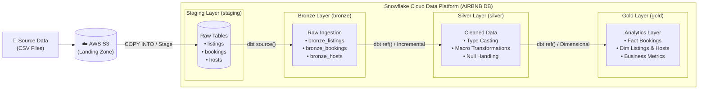

# 🏡 Airbnb Snowflake dbt Pipeline

An end-to-end data transformation and analytics pipeline for Airbnb data on Snowflake, modeled using **dbt** with a **Medallion (Bronze → Silver → Gold) Architecture**.

---

## 📌 Project Overview

This project implements an end-to-end ELT data pipeline for Airbnb datasets using **AWS S3**, **Snowflake**, and **dbt** with a **Medallion Architecture**:

```text
Source Data (CSV) ──> AWS S3 ──> Snowflake (Staging) ──> Bronze Layer ──> Silver Layer ──> Gold Layer
                                          │                     │               │              │
                                     Raw Tables            Raw Ingestion   Cleaned Data    Analytics
```

- **Source Data (CSV)**: Raw Airbnb CSV files (`listings.csv`, `bookings.csv`, `hosts.csv`).
- **AWS S3**: Cloud object storage acting as the external landing and staging repository.
- **Snowflake (Staging Layer)**: Raw relational tables in `AIRBNB.staging` loaded via Snowflake external stages / `COPY INTO`.
- **Bronze Layer (`AIRBNB.bronze`)**: Incremental 1-to-1 raw ingestion models managed by dbt.
- **Silver Layer (`AIRBNB.silver`)**: Cleaned, standardized, and enriched models applying business transformation macros.
- **Gold Layer (`AIRBNB.gold`)**: High-performance analytical fact and dimension models optimized for BI and metrics.

---

## 🏗️ Architecture & Data Flow



### ✅ Completed Work:
1. **Modern Python & Tooling Environment**:
   - Packaged and managed using **Astral `uv`** on Python 3.12.
   - Core libraries: `dbt-core (v1.12.5)`, `dbt-snowflake (v1.12.1)`, `boto3`.
2. **Snowflake Integration**:
   - Configured dbt Snowflake adapter connected to database `AIRBNB` and warehouse `SNOWFLAKE_LEARNING_WH`.
3. **Custom Schema Control**:
   - Custom `generate_schema_name` macro implemented to route tables directly into their dedicated schemas (`bronze`, `silver`, `gold`) without default schema prefixes.
4. **Source Declarations**:
   - Structured `sources.yml` mapping `AIRBNB.staging` tables (`listings`, `bookings`, `hosts`).
5. **Bronze Layer Ingestion**:
   - Models created for `bronze_listings`, `bronze_bookings`, and `bronze_hosts`.
   - Materialization configured as `incremental` utilizing dbt's `is_incremental()` macro with timestamp watermarking on `CREATED_AT`.
6. **Silver Layer Cleansing & Enrichment**:
   - Models created for `silver_bookings`, `silver_listings`, and `silver_hosts` (incremental).
   - DRY Jinja macros developed: `multiply` (dynamic rounding), `tag` (tier bucketing), `trimmer` (string trimming).
   - Schema tests configured (`unique`, `not_null` on all primary keys).
7. **Gold Layer (One Big Table - OBT)**:
   - Denormalized wide table `obt` joining bookings, listings, and hosts using dynamic Jinja loops.
   - Fully tested with primary key uniqueness and non-null referential integrity tests.
8. **Gold Layer (Star Schema & SCD Type 2 Snapshots)**:
   - **Type-2 Slowly Changing Dimensions (SCD2)**: Implemented `dim_bookings`, `dim_listings`, and `dim_hosts` using modern dbt YAML snapshots with active sentinel date (`to_date('9999-12-31')`).
   - **Ephemeral Staging**: Modularized ephemeral pre-processing models in `models/gold/ephemeral/` (`bookings.sql`, `listings.sql`, `hosts.sql`) to decouple entity grains.
   - **Dimensional Fact Table**: Implemented `facts.sql` using a DRY metadata-driven Jinja framework to join core booking metrics with dimension snapshots.
9. **Source Data Quality & Shift-Left Guardrails**:
   - Implemented `tests/source_tests.sql` to catch null keys, non-positive nights, negative fees, and out-of-range response rates at the raw S3 ingestion layer before downstream processing.
   - Restored end-to-end lineage for `IS_SUPERHOST`, `CLEANING_FEE`, and `SERVICE_FEE` across Silver and Gold.

10. **CI/CD Automation via GitHub Actions**:
    - Automated pull request validation: executes `dbt debug`, `dbt compile`, and `dbt test` to block regressions before merge.
    - Automated production deployment on `main`: executes `dbt snapshot` and `dbt build` across the entire pipeline.
    - Secure secrets management: injected credentials (`SNOWFLAKE_ACCOUNT`, `SNOWFLAKE_USER`, `SNOWFLAKE_PASSWORD`, etc.) via GitHub Actions Secrets.

---

## 🔄 CI/CD Automation (GitHub Actions)

The repository includes a production-grade CI/CD pipeline in [`.github/workflows/dbt_ci_cd.yml`](.github/workflows/dbt_ci_cd.yml):

```text
[ Developer PR ] ──> GitHub Actions CI ──> dbt debug ──> dbt compile ──> dbt test ──> [ Merge Allowed ]
                                                                                             │
[ Push to Main ] ──> GitHub Actions CD ──> dbt snapshot (SCD2) ──> dbt build (All Layers) ──┘
```

* **On Pull Request (`main`)**: Fast regression checks running `dbt test` against the staging/bronze/silver/gold layers.
* **On Push (`main`)**: Production execution building snapshots and models in DAG order (`dbt build`).
* **Manual Trigger (`workflow_dispatch`)**: Run ad-hoc commands (`build`, `test`, `snapshot`, `compile`) directly from GitHub Actions UI.

---

## 📂 Project Structure

```text
Airbnb Snowflake DBT Pipeline/
├── pyproject.toml                         # Project metadata and dependencies (managed via uv)
├── uv.lock                                # Deterministic lockfile
├── .gitignore                             # Ignored credentials, venvs, and build artifacts
├── README.md                              # Project documentation
│
└── airbnb_snowflake_dbt_pipeline/        # Core dbt project
    ├── dbt_project.yml                    # dbt project configuration & schema mapping
    ├── profiles.yml                       # Connection profile (git-ignored for security)
    │
    ├── macros/
    │   ├── generate_schema_name.sql       # Custom macro for clean bronze/silver/gold schemas
    │   ├── multiply.sql                   # Dynamic precision multiplication macro
    │   ├── tag.sql                        # Conditional price tier bucketing macro
    │   └── trim.sql                       # Reusable whitespace trimming macro
    │
    ├── models/
    │   ├── sources/
    │   │   └── sources.yml                # Raw staging source definitions
    │   ├── bronze/                        # Bronze layer models (incremental)
    │   │   ├── bronze_listings.sql
    │   │   ├── bronze_bookings.sql
    │   │   ├── bronze_hosts.sql
    │   │   └── properties.yml
    │   ├── silver/                        # Silver layer models (incremental)
    │   │   ├── silver_bookings.sql
    │   │   ├── silver_listings.sql
    │   │   ├── silver_hosts.sql
    │   │   └── properties.yml
    │   └── gold/                          # Gold layer models (analytical marts)
    │       ├── obt.sql                    # One Big Table (OBT) denormalized mart
    │       ├── facts.sql                  # Central dimensional fact table
    │       ├── ephemeral/                 # Ephemeral deduplicated dimension feeds
    │       │   ├── bookings.sql
    │       │   ├── listings.sql
    │       │   └── hosts.sql
    │       └── properties.yml
    │
    ├── analyses/                          # Ad-hoc exploratory queries & Jinja experiments
    ├── snapshots/                         # SCD Type 2 YAML snapshot definitions
    │   ├── dim_bookings.yml
    │   ├── dim_listings.yml
    │   └── dim_hosts.yml
    └── tests/                             # Custom singular and gatekeeper data tests
        ├── source_tests.sql               # S3/Staging ingestion guardrail
        ├── assert_bronze_silver_row_counts_match.sql
        ├── assert_obt_row_count_matches_bookings.sql
        ├── assert_total_amount_is_positive.sql
        ├── assert_response_rate_in_range.sql
        └── assert_listing_price_and_capacity.sql
```

---

## 🚀 Getting Started

### 1. Prerequisites
- [uv](https://docs.astral.sh/uv/) installed: `brew install uv`
- Access to a Snowflake account with appropriate database and warehouse privileges.

### 2. Install Dependencies
```bash
uv sync
source .venv/bin/activate
```

### 3. Configure Connection Profile
Ensure your `~/.dbt/profiles.yml` or `airbnb_snowflake_dbt_pipeline/profiles.yml` is configured:

```yaml
airbnb_snowflake_dbt_pipeline:
  target: dev
  outputs:
    dev:
      type: snowflake
      account: <YOUR_SNOWFLAKE_ACCOUNT>
      user: <YOUR_USERNAME>
      password: <YOUR_PASSWORD>   # Or use private_key_path for key-pair auth
      role: ACCOUNTADMIN
      warehouse: SNOWFLAKE_LEARNING_WH
      database: AIRBNB
      schema: dbt_schema
      threads: 1
```

### 4. Validate Setup
```bash
cd airbnb_snowflake_dbt_pipeline
dbt debug
```

### 5. Execute Snapshots & Models
```bash
# Compile and check DAG
dbt compile

# Run Type-2 SCD Snapshots
dbt snapshot

# Run all models and tests in DAG order
dbt build

# Or run specific layers:
dbt run --select silver
dbt run --select gold
dbt test
```

---

## 🗺️ Next Steps
- [x] Develop **Silver Layer**: Data cleansing, handling nulls, type-casting, and business transformations (`silver_bookings`, `silver_listings`, `silver_hosts`).
- [x] Create reusable Jinja macros for transformations (`multiply`, `tag`, `trimmer`).
- [x] Implement data quality tests (uniqueness, not-null, referential integrity).
- [x] Build **Gold Layer - OBT**: Denormalized One Big Table (`obt`) combining Silver layer models using dynamic Jinja loops.
- [x] Build **Gold Layer - Star Schema**: Dimensional fact table (`facts`) and SCD Type 2 dimensions (`dim_bookings`, `dim_listings`, `dim_hosts`).
- [x] Implement Shift-Left **Source Guardrails**: `source_tests.sql` for raw S3 ingestion validation.
- [x] Implement CI/CD automated pipeline via GitHub Actions for automated `dbt test` and `dbt build`.
- [ ] Connect BI Semantic Layer / Tableau / Metabase to `AIRBNB.gold`.
