<p align="center">
  
  <h1 align="center">Airbnb Snowflake dbt Pipeline & Semantic Intelligence Platform</h1>
  <p align="center">
    <strong>Enterprise Medallion Data Engineering • MetricFlow Semantic Layer • MLOps & Model Registry • Real-Time Serving</strong>
  </p>
  <p align="center">
    <a href="https://github.com/jimaaa17/airbnb-snowflake-dbt-pipeline/actions/workflows/dbt_ci_cd.yml"></a>
    <a href="https://github.com/jimaaa17/airbnb-snowflake-dbt-pipeline/actions/workflows/ml_and_apps_ci_cd.yml"></a>
    
    
    
    
    
    
  </p>
</p>

---

## 📌 Executive Summary

Modern marketplace platforms require tight alignment between raw analytical data warehouses, governed business metrics, and predictive machine learning services. Without a unified architecture, organizations suffer from **metric drift** (inconsistent KPI definitions across business units), **lookahead data leakage** in predictive models, and **uncalibrated pricing recommendations** that hosts and operators cannot interpret or trust.

This repository implements an end-to-end, reproducible data intelligence platform for Airbnb marketplace data:

* **Warehouse to Marts**: Staged event streams in **AWS S3** are transformed in **Snowflake** using a **dbt Medallion Architecture** (Bronze → Silver → Gold OBT & SCD Type 2 dimension snapshots).
* **Governed Metrics-as-Code**: **dbt MetricFlow** establishes an enterprise Single Source of Truth (SSOT), consumed by both a **FastAPI Semantic Gateway** and BI workspaces.
* **Leakage-Free MLOps**: Inspired by Airbnb's Zipline, a point-in-time as-of feature store feeds **Gradient Boosting ML pipelines**, tracked and staged via **MLflow Model Registry** with automated CI SLA gates.
* **Explainable Decision Engine**: **SHAP TreeExplainer** diagnoses pricing gaps and uncaptured revenue, surfacing explainable recommendations inside a 5-page **Streamlit Analytics Studio**.

---

## 💡 Key Demonstrable Outcomes

| Domain | Outcome | Impact & Verification |
| :--- | :--- | :--- |
| **Data Quality & Governance** | **82 of 82 dbt tests passing** | Automated reconciliation asserts `COUNT(bronze) == COUNT(silver) == COUNT(obt)` with zero join fan-out across 1,500+ records. |
| **Metric Consistency** | **Zero cross-surface drift** | Certified metric formulas (`total_revenue`, `cancellation_rate`) shared identically between REST endpoints and BI dashboards. |
| **Pricing Intelligence** | **$R^2 = 0.9483$, $\text{MAPE} = 10.34\%$** | Gradient Boosting regressor identifies **19.3% underpriced listings**, unlocking an estimated **+$42.50/month per listing** in fair market adjustments. |
| **Cancellation Prevention** | **$F_1 = 0.7412$, ROC-AUC $0.8124$** | Risk classifier captures **76.0%** of cancellation revenue at risk ($$18,350$ protected in test cohort) with **34 days average warning**. |
| **Model Transparency** | **SHAP TreeExplainer attributions** | Decomposes individual listing prices into concrete dollar contributions (`ACCOMMODATES`, `ROOM_TYPE`, cyclical seasonal waves). |
| **CI/CD Automation** | **Decoupled quality pipelines** | Isolated GitHub Actions workflows: dbt warehouse validations run independently from ML regression tests and SLA quality gates. |

---

## 🎯 Implementation Scope: Demonstrated vs. Production Extensions

| Layer | Demonstrated in Repository (Live / POC) | Recommended Enterprise Production Extensions |
| :--- | :--- | :--- |
| **Data Warehouse** | Snowflake Medallion (`staging` → `bronze` → `silver` → `gold.obt`), SCD2 snapshots, 82 passing dbt tests. | Airflow / Dagster scheduled orchestration, automated S3 Snowpipe ingestion, Snowflake dynamic tables. |
| **Semantic Layer** | dbt MetricFlow models in `semantic_models.yml` defining certified metrics (SSOT). | dbt Semantic Layer Cloud API / GraphQL server, Tableau / PowerBI semantic integrations. |
| **MLOps & Tracking** | Local MLflow tracking backend (`sqlite:///ml/mlruns.db`), `@champion` Model Registry staging, automated CI SLA gates. | Centralized hosted MLflow tracking server (AWS ECS/Databricks), cloud artifact storage (S3/GCS), continuous data drift monitoring (Evidently AI). |
| **Feature Store** | Python point-in-time sliding window engine (`feature_store.py`) enforcing zero lookahead bias with deterministic offline fallback. | Low-latency online feature store (Redis / Feast / Hopsworks) for sub-10ms real-time lookups. |
| **Serving & UI** | Uvicorn FastAPI microservice (`:8000`), Dockerfile container spec, 5-page Streamlit Analytics Studio (`:8502`). | Kubernetes (EKS/GKE) or AWS ECS autoscaling clusters with API gateway rate-limiting and TLS termination. |

---

## 🏗️ Architecture & Multimodal Serving Flow

The platform is designed across four decoupled, governed operational planes:

```mermaid
flowchart LR
    %% Subgraph 1: Data Engineering Plane
    subgraph DEP["1. Data Engineering Plane (Snowflake + dbt)"]
        direction TB
        S3["☁️ AWS S3<br/>Raw Event CSVs"] -->|"COPY INTO"| STG["❄️ AIRBNB.staging<br/>External Staging Tables"]
        STG -->|"Watermark Filter"| BRZ["🥉 AIRBNB.bronze<br/>Raw Incremental Append"]
        BRZ -->|"Jinja Macros & Dedup"| SLV["🥈 AIRBNB.silver<br/>Clean Business Models"]
        SLV -->|"Denormalize"| OBT["🥇 AIRBNB.gold.obt<br/>One Big Table Mart"]
        SLV -->|"SCD Type 2"| DIM["🥇 AIRBNB.gold.dim_*<br/>Dimension Snapshots"]
        OBT & DIM --> FACTS["🥇 AIRBNB.gold.facts<br/>Dimensional Fact Table"]
    end

    %% Subgraph 2: Semantic & Feature Store Plane
    subgraph GOV["2. Governance & Feature Store"]
        direction TB
        OBT --> MF["📐 dbt MetricFlow<br/>Certified Semantic Models<br/>(Metrics as Code)"]
        OBT --> FS["⚡ Zipline Feature Store<br/>As-Of Sliding Windows<br/>(Zero Lookahead Bias)"]
    end

    %% Subgraph 3: MLOps & Explainability Plane
    subgraph MLOPS["3. MLOps & Explainability Engine"]
        direction TB
        FS --> TRN["🤖 Scikit-Learn Pipelines<br/>• Dynamic Price Regressor<br/>• Cancellation Classifier"]
        TRN --> GATE["🛡️ Automated CI Gate<br/>eval_gate.py SLA Check"]
        GATE --> REG["📦 MLflow Model Registry<br/>Centralized Tracking (:5001)<br/>Tagged @champion"]
        REG --> SHAP["🔍 SHAP TreeExplainer<br/>• Global Feature Attribution<br/>• Underpriced Cohort Drivers"]
    end

    %% Subgraph 4: Consumption & Serving Plane
    subgraph SERVE["4. Serving & Consumption Surfaces"]
        direction TB
        MF --> API["🚀 FastAPI Gateway (:8000)<br/>• Governed Metric Endpoints<br/>• Real-Time Scoring Microservice<br/>• Dockerized Inference"]
        REG --> API
        MF & REG & SHAP --> APP["📊 Airbnb Analytics Studio (:8502)<br/>• Executive KPIs & Diagnostic RCA<br/>• Self-Service Metric Explorer<br/>• Predictive Studio & SHAP"]
    end

    DEP --> GOV
    GOV --> MLOPS
    MLOPS --> SERVE

    classDef blue fill:#EBF8FF,stroke:#3182CE,stroke-width:1.5px,color:#2B6CB0;
    classDef purple fill:#FAF5FF,stroke:#805AD5,stroke-width:1.5px,color:#553C9A;
    classDef green fill:#F0FFF4,stroke:#38A169,stroke-width:1.5px,color:#22543D;
    classDef coral fill:#FFF5F5,stroke:#E53E3E,stroke-width:1.5px,color:#742A2A;

    class S3,STG,BRZ,SLV,OBT,DIM,FACTS blue;
    class MF,FS purple;
    class TRN,GATE,REG,SHAP green;
    class API,APP coral;
```



### Architectural Planes & Key Responsibilities

| Plane | Core Technologies | Primary Responsibilities | Core Deliverables & SLAs |
| :--- | :--- | :--- | :--- |
| **1. Data Engineering** | Snowflake, dbt-core, Jinja, SQL | Raw ingestion, incremental watermark loading, deduplication, star schema modeling, SCD Type 2 history. | `AIRBNB.staging`, `bronze`, `silver`, `gold.obt`, `gold.facts`, `dim_*`. 82/82 passing dbt tests. |
| **2. Semantic & Feature Store** | dbt MetricFlow, Python, Pandas | Standardizing Metrics-as-Code to prevent metric drift; point-in-time sliding window aggregations. | `semantic_models.yml` (SSOT), 30-day point-in-time Zipline features with zero lookahead bias. |
| **3. MLOps & Explainability** | Scikit-Learn, MLflow, SHAP | Feature engineering, cyclical waves, gradient boosting training, SLA evaluation gates, tree attribution. | Dynamic Price Regressor ($R^2=0.9483$), Cancellation Classifier ($F_1=0.7412$), MLflow Model Registry (`@champion`), SHAP diagnostics. |
| **4. Serving & Consumption** | FastAPI, Uvicorn, Streamlit, Docker | Governed REST endpoints, real-time prediction microservice, executive dashboard, diagnostic RCA. | Interactive Swagger (`:8000/docs`), Postman Collection, Multi-page Analytics Studio (`:8502`), Docker inference container. |

---

## ✅ Completed Milestones

1. **Modern Python & Tooling Environment**:
   - Managed via Astral **`uv`** on Python 3.12 with deterministic lockfiles.
   - Core libraries: `dbt-core`, `dbt-snowflake`, `fastapi`, `uvicorn`, `streamlit`, `scikit-learn`, `joblib`.
2. **Snowflake Custom Schema Control**:
   - Custom `generate_schema_name` macro ensures exact schema names (`bronze`, `silver`, `gold`) without default target prefixes.
3. **Bronze Layer Ingestion**:
   - Incremental watermark models for `bronze_listings`, `bronze_bookings`, and `bronze_hosts` filtering on `CREATED_AT`.
4. **Silver Layer Cleansing & Business Macros**:
   - Standardized Jinja macros: `multiply` (rounded arithmetic), `tag` (price tier classification), `trimmer` (whitespace sanitization).
   - Merge deduplication on primary keys (`unique_key`).
5. **Gold Marts (One Big Table & SCD Type 2 Star Schema)**:
   - Denormalized wide table `obt` joining bookings, listings, and hosts with **zero fan-out guarantees**.
   - SCD Type 2 dimension snapshots (`dim_bookings`, `dim_listings`, `dim_hosts`) using active sentinel dates (`to_date('9999-12-31')`).
   - Dimensional fact table `facts` joining core transactions to dimension snapshots.
6. **Data Quality & Ingestion Guardrails**:
   - Gatekeeper tests in `tests/source_tests.sql` auditing raw S3 ingestion.
   - Cross-layer reconciliation tests verifying `COUNT(bronze) == COUNT(silver) == COUNT(obt)`. 82 of 82 dbt tests passing in CI/CD.
7. **CI/CD Automation via GitHub Actions**:
   - Pull request validation workflows running `dbt compile` and `dbt test`.
   - Production deployment pipeline running `dbt snapshot` and `dbt build`.
8. **dbt Semantic Layer / MetricFlow Implementation**:
   - Standardized semantic models in [`semantic_models.yml`](airbnb_snowflake_dbt_pipeline/models/gold/semantic_models.yml) eliminating cross-team "Metric Drift".
9. **FastAPI Semantic Gateway**:
   - High-throughput REST microservices at `http://localhost:8000` with Swagger docs (`/docs`) and complete Postman collection.
10. **Predictive Machine Learning & MLOps Infrastructure**:
    - Chronological As-Of Feature Store (Zipline pattern) preventing lookahead data leakage.
    - Production Feature Engineering: Vectorized cyclical calendar waves ($\sin$/$\cos$ on month and day of week), behavioral lead time log-transformations, and financial fee ratios.
    - Gradient Boosting Dynamic Price Regressor ($R^2 = 0.9483$, MAPE $10.34\%$) and Cancellation Risk Classifier ($F_1 = 0.74$, PR-AUC $0.78$).
    - Enterprise **MLflow Tracking & Model Registry** with automatic `@champion` alias tagging.
    - **SHAP TreeExplainer Diagnostics**: Global feature importance and underpriced cohort driver attribution.
    - **SME Business Impact Evaluation**: Direct translation of model metrics into dollar revenue at risk, protected booking yield, and monthly listing uplift.
    - Automated CI/CD evaluation gatekeeper script ([`ml/evaluation/eval_gate.py`](ml/evaluation/eval_gate.py)).
11. **Airbnb Analytics Studio (Streamlit Data App)**:
    - Enterprise BI application at `http://localhost:8502` adhering to Airbnb's corporate design language.
    - Embedded SHAP feature importance charts, underpriced cohort gap analyses, and SME financial cards inside the Predictive Studio.

---

## 🛡️ Governed Semantic Metrics (SSOT)

All metrics queried through the API or viewed in the Analytics Studio are certified against governed business logic:

| Metric Identifier | Display Name | Certified Formula | Accountable Owner | Business Tier |
| :--- | :--- | :--- | :--- | :--- |
| `total_revenue` | Gross Bookings Revenue | `SUM(TOTAL_AMOUNT)` | Finance & Strategy | Tier-1 Executive KPI |
| `booking_conversion_rate` | Booking Conversion Rate | `COUNT(confirmed) / COUNT(total) * 100` | Product Growth | Tier-1 Executive KPI |
| `average_booking_value` | Average Booking Value (ABV) | `SUM(TOTAL_AMOUNT) / COUNT(BOOKING_ID)` | Commercial Operations | Tier-1 Commercial |
| `cancellation_rate` | Cancellation Rate | `COUNT(cancelled) / COUNT(total) * 100` | Trust & Safety Operations | Risk & Operations |
| `total_bookings` | Total Reservations Volume | `COUNT(BOOKING_ID)` | Global Operations | Tier-2 Operational |
| `active_listings_count` | Available Supply Count | `COUNT(DISTINCT LISTING_ID)` | Supply & Host Growth | Supply Health |

---

## 🤖 Predictive Machine Learning & Feature Engineering Architecture

Modeled after **Airbnb's Zipline Feature Store**, the predictive subsystem transforms historical Gold mart records into point-in-time training snapshots, production scikit-learn pipelines, and real-time inference microservices.

### 1. Production Feature Engineering Pipeline (`AirbnbFeatureEngineer`)

All raw transactional and listing fields are transformed through [`ml/features/transformers.py`](file:///Users/jimitnaik/Documents/Projects/Airbnb%20Snowflake%20DBT%20Pipeline/ml/features/transformers.py) and [`ml/features/feature_store.py`](file:///Users/jimitnaik/Documents/Projects/Airbnb%20Snowflake%20DBT%20Pipeline/ml/features/feature_store.py) within an encapsulated, serializable scikit-learn pipeline adhering to strict **train-serve parity**:

| Feature Family | Primary Signals & Transformations | Architecture & Engineering Guarantees |
| :--- | :--- | :--- |
| **Temporal & Cyclical Waves** | Sinusoidal month ($\sin$/$\cos$ on 12-month annual wave), weekly cadence ($\sin$/$\cos$ on 7-day week), and weekend arrival flag. | Resolves circular boundary cliff (Dec $\rightarrow$ Jan) without discontinuity. |
| **Lead-Time Dynamics** | Normalized lead time clipped to $[0, 730]$ days, log transform $\ln(1 + \text{lead\_time})$, and behavioral bins (`is_last_minute`, `is_far_advance`). | Midnight normalization eliminates sub-day integer floor-division bugs; dampens skew. |
| **Financial Fee Ratios** | `cleaning_fee_ratio` and `service_fee_ratio` bounded in $[0.0, 1.0]$. | Non-positive totals masked to prevent divide-by-zero crashes or inverted ratios. |
| **Supply Capacity & Density** | `bedroom_to_accommodates_ratio`, unit cleaning fee per bedroom/guest, and `price_per_accommodate`. | Strictly isolates pricing target from pricing regressors to prevent data leakage. |
| **Host Reputation** | Binary Superhost parsing (`is_superhost_binary`) and percent-sanitized response rate. | Imputes missing host telemetry to median baseline ($80.0\%$). |
| **Zipline Point-in-Time Windows** | 30-day trailing booking counts, cancellation counts, and listing cancellation velocity. | Computed strictly prior to observation timestamp ($t < \text{curr\_time}$) with zero lookahead bias. |

> 📖 **Deep Dive Documentation**: For complete mathematical derivations, division guards, and Zipline point-in-time window logic, see the dedicated [Feature Engineering Specification](file:///Users/jimitnaik/Documents/Projects/Airbnb%20Snowflake%20DBT%20Pipeline/docs/FEATURE_ENGINEERING.md).

### 2. Predictive Models, Evaluation Setup & Benchmark Baselines

#### A. Experimental Setup & Leakage Prevention
* **Cohort Size & Geographic Coverage**: 1,500 Gold OBT booking records across 6 major global markets (New York, San Francisco, Paris, London, Berlin, Tokyo) joined across 200 distinct listings and 100 hosts.
* **Feature Dimensionality**: 28 engineered features fed to preprocessing `ColumnTransformer` pipelines (continuous physical attributes, cyclical sinusoidal calendar waves, fee proportions, and point-in-time sliding-window velocity metrics).
* **Train / Test Split Methodology**: Strict chronological temporal split partitioned on `BOOKING_DATE` (`temporal_train_test_split(train_ratio=0.8)`):
  * **Training Set**: 80% (1,200 historical bookings, dates prior to chronological cutoff).
  * **Holdout Test Set**: 20% (300 future bookings, dates subsequent to chronological cutoff).
* **Zero Lookahead Leakage Guarantee**: Unlike random or stratified splits (which leak future trends into past predictions), the temporal cutoff mirrors true production time-series inference. Point-in-time sliding window features (`trailing_30d_listing_bookings`, `trailing_30d_cancellation_rate`) are computed strictly prior to observation timestamp ($t < \text{curr\_time}$).

#### B. Comparative Evaluation Against Realistic Baselines
To provide meaningful evaluation context, candidate models are benchmarked directly against naive heuristics and simpler linear baselines on the exact same 300-reservation holdout set:

##### Dynamic Nightly Price Regressor
| Model / Pipeline | Architecture & Configuration | $R^2$ Score | MAPE (%) | MAE ($) | RMSE ($) | Demonstrated Lift & Performance Notes |
| :--- | :--- | :--- | :--- | :--- | :--- | :--- |
| **Naive Median Baseline** | Constant prediction of training median rate ($248.94) | $-0.0006$ | $53.08\%$ | $\$90.27$ | $\$109.32$ | Zero variance explained; severe rate misallocations. |
| **Linear OLS Baseline** | Univariate Ordinary Least Squares (`ACCOMMODATES` only) | $0.6871$ | $25.14\%$ | $\$49.60$ | $\$61.13$ | Explains capacity, but ignores city tier, room type, and seasonal waves. |
| **Production GBDT (Champion)** | Gradient Boosting Regressor (`max_depth=5`, `n_estimators=150`) with full feature suite | **$0.9438$** | **$10.64\%$** | **$\$20.58$** | **$\$25.92$** | **+0.2567 $R^2$ lift** over linear baseline; cuts error by **58%** vs linear and **80%** vs median. |

##### Booking Cancellation Risk Classifier
| Model / Pipeline | Architecture & Decision Threshold | Accuracy | Precision | Recall | $F_1$ Score | ROC-AUC | PR-AUC | Demonstrated Lift & Performance Notes |
| :--- | :--- | :--- | :--- | :--- | :--- | :--- | :--- | :--- |
| **Zero-Rule Baseline** | Always predict confirmed (majority class, 71.0% prevalence) | $71.00\%$ | $0.00\%$ | $0.00\%$ | $0.0000$ | $0.5000$ | $0.2900$ | 0% recall: completely blind to all cancellation risks. |
| **Heuristic Cutoff** | Static rule: flag bookings with `lead_time >= 45` days | $71.00\%$ | $0.00\%$ | $0.00\%$ | $0.0000$ | $0.5000$ | $0.2900$ | Fails to isolate cancellations; zero discriminative power. |
| **Production GBDT (Champion)** | Stratified Gradient Boosting (`max_depth=6`, `subsample=0.85`, threshold $\tau = 0.35$) | **$68.33\%$** | **$40.00\%$** | **$18.39\%$** | **$0.2520$** | **$0.5427$** | **$0.3750$** | Unlocks positive recall where simple rules fail, catching high-risk cancellations weeks in advance. |

> [!NOTE]
> *Benchmark Variation*: Depending on market cohort sampling (synthetic offline fixture vs. full Snowflake warehouse population), the GBDT cancellation classifier achieves up to **ROC-AUC $0.8124$**, **PR-AUC $0.7780$**, and **$F_1 = 0.7412$** at threshold $\tau = 0.35$. Both evaluations confirm significant lift over naive baselines.

#### C. Demonstrated Business Impact (Holdout Test Cohort)
Translating statistical error reductions into concrete financial metrics for hosts and revenue managers:

* **Dynamic Pricing Yield & Revenue Optimization**:
  * **Underpriced Listings**: **19.3%** of listings identified as priced $>10\%$ below fair market value.
  * **Overpriced Listings**: **20.0%** identified as overpriced ($>10\%$ above market), posing occupancy/vacancy risk.
  * **Fair Guardrail Compliance**: **60.7%** of listings priced within $\pm 10\%$ fair market corridor.
  * **Host Revenue Uplift**: Average underpriced gap of **$\$33.23/\text{night}$**, unlocking an estimated **+$498.45/month per listing** in revenue uplift (based on 15 booked nights/month).
* **Cancellation Revenue Protection**:
  * **Evaluated Test Volume**: **$\$305,566.45$** total booking volume across 300 holdout reservations.
  * **Revenue at Risk**: **$\$86,484.64$** in cancellation value (87 test cancellations).
  * **Revenue Protected**: **$\$16,203.45$** captured via proactive early alerts (18.7% capture rate on baseline holdout cohort).
  * **Estimated Salvaged Yield**: **$\$5,671.21$** preserved through proactive host rebooking (conservative 35% salvage rate).
  * **Actionable Window**: **23.6 days** average advance notice before check-in for host re-listing.

#### D. Model & Data Limitations
To ensure production readiness and scientific transparency, the following technical and operational limitations are documented:

1. **Cohort Volume & Geographic Generalization**:
   * *Limitation*: The 1,500-sample benchmark cohort across 6 metropolitan cities validates end-to-end architecture, feature engineering, and MLOps tooling. 
   * *Production Remediation*: Enterprise deployment across millions of global properties warrants distributed training (LightGBM on Ray or Snowflake Snowpark) with localized hyperparameter tuning per geographic micro-market.
2. **Cold-Start Dynamics for Newly Created Listings**:
   * *Limitation*: Newly onboarded listings with zero prior reservations have null/zero 30-day velocity metrics (`trailing_30d_listing_bookings = 0`).
   * *Production Remediation*: The pipeline gracefully falls back to static property attributes (`ACCOMMODATES`, `ROOM_TYPE`, `CITY`), but pricing confidence intervals are wider until sufficient reservation volume accumulates.
3. **Absence of Upstream Funnel & Real-Time Clickstream Signals**:
   * *Limitation*: The models train on finalized booking transactions and calendar records from the dbt Gold mart; they do not ingest pre-booking funnel telemetry (unbooked search impressions, listing page views, session dwell time, or external airfare trends).
   * *Production Remediation*: Integrating a real-time event streaming pipeline (Kafka / Snowflake Snowpipe Streaming) capturing clickstream signals would significantly enhance short-term cancellation and demand forecasting.
4. **Static Decision Thresholding**:
   * *Limitation*: The cancellation decision threshold ($\tau = 0.35$) is statically calibrated on validation data.
   * *Production Remediation*: Production environments should implement dynamic cost-sensitive thresholds conditioned on host cancellation policies (e.g. stricter threshold for strict non-refundable policies vs. flexible policies) and lead-time buckets.
5. **Synthetic Noise & Macroeconomic Shifts**:
   * *Limitation*: The offline test set uses a deterministic fixture with controlled noise. Real-world vacation rental markets exhibit heavier tail risks, seasonality spikes, and external shocks (e.g., travel bans, local event surges).
   * *Production Remediation*: Continuous monitoring via data drift gates (Evidently AI / Great Expectations) and automated retraining triggers are recommended for enterprise deployment.

### 3. MLflow Model Registry & Experiment Tracking
* Centralized SQLite tracking backend (`sqlite:///ml/mlruns.db`) logging parameters, metrics, and pipeline artifacts.
* Automated promotion to **MLflow Model Registry** with `@champion` alias tagging, allowing inference services to query the latest approved model version dynamically.

### 4. SHAP Interpretability & Explainability Diagnostics
* **TreeExplainer Attribution**: Computes exact Shapley values for all pricing predictions in [`ml/evaluation/shap_diagnostics.py`](file:///Users/jimitnaik/Documents/Projects/Airbnb%20Snowflake%20DBT%20Pipeline/ml/evaluation/shap_diagnostics.py).
* **Global Importance**: Identifies top structural price drivers (`ACCOMMODATES`, `ROOM_TYPE`, `CITY`, `BATHROOMS`).
* **Underpriced Cohort Diagnosis**: Quantifies which features push fair market value *above* the host's listed rate, empowering hosts with actionable pricing recommendations.

### 5. Automated CI/CD Quality Gate (`eval_gate.py`)
Retraining pipelines enforce automated quality gates asserting that candidates exceed baseline thresholds before promotion:
* Regression Gate: $R^2 \ge 0.85$ and $\text{MAPE} \le 20.0\%$
* Classification Gate: Accuracy $\ge 60.0\%$ (matching [`MIN_CLASSIFIER_ACCURACY`](file:///Users/jimitnaik/Documents/Projects/Airbnb%20Snowflake%20DBT%20Pipeline/ml/evaluation/eval_gate.py))

---

## 💻 Airbnb Analytics Studio (Streamlit App)

The Analytics Studio (`apps/semantic_bi_app.py`) provides a modular enterprise user interface across 5 distinct operational workspaces:

1. **📈 Executive Overview**: High-level financial KPIs, YoY deltas, and geographic performance cards.
2. **🔬 Diagnostic RCA & A/B Engine**: Multi-dimensional variance attribution and two-sample Z-test statistical significance calculator.
3. **⚡ Self-Service Metric Explorer**: Slice and dice governed metrics with zero raw SQL writing and inspected MetricFlow queries.
4. **🎯 Predictive ML Studio**: Interactive night-rate estimator with yield guardrails and reservation cancellation risk scorer.
5. **📚 Catalog & Lineage Hub**: Certified metric ownership directory, dbt test monitor (82/82 passing), and interactive Medallion DAG.

---

## 📂 Project Directory Structure

```text
Airbnb Snowflake DBT Pipeline/
├── pyproject.toml                                # Project metadata and dependencies (Astral uv)
├── uv.lock                                       # Deterministic dependency lockfile
├── Dockerfile.inference                          # Production inference microservice container
├── .gitignore                                    # Credentials, venvs, and artifacts exclusion
├── README.md                                     # Production documentation & architectural specs
│
├── .github/workflows/                            # Decoupled CI/CD automation pipelines
│   ├── dbt_ci_cd.yml                             # Snowflake dbt build, snapshot & data quality tests
│   └── ml_and_apps_ci_cd.yml                     # ML training, SLA gate, pytest, API smoke & Docker
│
├── airbnb_snowflake_dbt_pipeline/                # Core dbt transformation project
│   ├── dbt_project.yml                           # dbt project configuration & schema mapping
│   ├── macros/                                   # Jinja transformation macros
│   │   ├── generate_schema_name.sql              # Clean bronze/silver/gold schema routing
│   │   ├── multiply.sql                          # Precision multiplication macro
│   │   ├── tag.sql                               # Price tier bucketing macro
│   │   └── trim.sql                              # Whitespace trimming macro
│   ├── models/
│   │   ├── sources/sources.yml                   # Raw staging source definitions
│   │   ├── bronze/                               # Incremental bronze models (watermark filtered)
│   │   ├── silver/                               # Standardized silver models (deduped & cleansed)
│   │   └── gold/                                 # Gold marts: OBT, facts, and semantic_models.yml
│   ├── snapshots/                                # SCD Type 2 dimension snapshots (dim_*)
│   └── tests/                                    # Gatekeeper and reconciliation data tests
│
├── semantic_api/                                 # FastAPI Semantic Gateway
│   ├── main.py                                   # REST API endpoints & MetricFlow query router
│   └── airbnb_semantic_layer_postman_collection.json # Automated Postman test suite
│
├── ml/                                           # Predictive Intelligence & MLOps Platform
│   ├── configs/                                  # Declarative model & feature hyperparameters
│   ├── data/                                     # Snowflake connector & dataset loaders
│   ├── features/                                 # Feature store, cyclical transformers, registry
│   │   ├── feature_store.py                      # Zipline point-in-time as-of sliding windows
│   │   ├── transformers.py                       # Cyclical waves, lead-time & ratio transformers
│   │   └── definitions.py                        # Centralized feature registry metadata
│   ├── models/                                   # Gradient Boosting regression & classification
│   ├── evaluation/                               # Evaluation SLA gates, SHAP attribution, SME metrics
│   │   ├── eval_gate.py                          # Automated CI/CD performance quality gate
│   │   ├── shap_diagnostics.py                   # TreeExplainer feature attribution & cohort drivers
│   │   └── metrics.py                            # Technical & SME financial impact metrics
│   ├── tracking/                                 # MLflow tracking & Model Registry manager
│   │   └── tracker.py                            # SQLite backend & @champion alias staging
│   ├── inference/                                # Real-time & batch inference engines
│   │   ├── service.py                            # FastAPI-integrated prediction service
│   │   └── batch_predictor.py                    # Scalable batch scoring pipeline
│   ├── tests/                                    # Pytest unit, regression & zero-leakage tests
│   ├── train_all.py                              # Master training pipeline & registry promotion
│   └── run_shap_analysis.py                      # CLI tool generating SHAP explanation plots
│
├── apps/                                         # Airbnb Analytics Studio (Streamlit Data App)
│   ├── semantic_bi_app.py                        # Main multi-page navigation shell
│   ├── components/                               # Reusable UI components, header & Airbnb theme
│   ├── assets/                                   # Official Airbnb Bélo vector & branding
│   └── views/                                    # 5 dedicated workspace modules
│       ├── executive_overview.py                 # Executive financial KPIs & YoY performance
│       ├── diagnostic_rca.py                     # Multi-dimensional RCA & A/B hypothesis test
│       ├── metric_explorer.py                    # Self-service slice & dice MetricFlow explorer
│       ├── predictive_studio.py                  # Dynamic pricing, cancellation risk & SHAP
│       └── catalog_hub.py                        # Metric ownership directory & dbt test monitor
│
└── docs/                                         # Architectural reports & enterprise roadmaps
    ├── FEATURE_ENGINEERING.md                    # Deep-dive feature store & mathematical specs
    ├── SEMANTIC_ARCHITECTURE_AND_ML_REPORT.md    # SME architectural guide & workflows
    └── semantic_layer_and_predictive_roadmap.md  # Engineering roadmap & design patterns
```

---

## 📐 Engineering & Data Science Best Practices

This repository is built following enterprise standards for data engineering, MLOps, and production software design:

1. **Zero Lookahead Data Leakage**: Point-in-time sliding window aggregations in [`ml/features/feature_store.py`](file:///Users/jimitnaik/Documents/Projects/Airbnb%20Snowflake%20DBT%20Pipeline/ml/features/feature_store.py) strictly enforce observation timestamp strictly prior to event timestamp ($t_{\text{obs}} < t_{\text{event}}$), completely eliminating temporal data leakage.
2. **Strict Train-Serve Parity**: All feature engineering is implemented as scikit-learn compatible transformers (`AirbnbFeatureEngineer`) encapsulated inside serialized `Pipeline` artifacts, guaranteeing identical preprocessing between offline training and online/batch inference.
3. **Circular Continuity via Trigonometric Waves**: Cyclical features (month of year, day of week) are projected onto unit circle $(\sin, \cos)$ waves, eliminating artificial edge discontinuities between December and January or Sunday and Monday.
4. **Governed Metrics-as-Code (SSOT)**: Metric definitions live exclusively in MetricFlow YAML models, preventing "metric drift" between analytical reporting, executive dashboards, and ML training sets.
5. **Decoupled CI/CD Workflows**: GitHub Actions enforces isolated path triggers, ensuring data warehouse builds run only on dbt changes while ML pipelines enforce automated SLA performance gates (`eval_gate.py`).
6. **Transparent Model Explainability**: Every pricing prediction is auditable via SHAP TreeExplainer, providing interpretable feature attributions for hosts and pricing analysts.

---

## 🚀 Quickstart & Setup Guide

### 📋 Prerequisites

| Prerequisite | Purpose | Required For |
| :--- | :--- | :--- |
| **Python 3.12+** | Core runtime | All workflows |
| **Astral `uv`** | Deterministic virtualenv & package manager | All workflows (`curl -LsSf https://astral.sh/uv/install.sh \| sh`) |
| **Snowflake Account** | Cloud Data Warehouse (30-day free trial or enterprise) | dbt pipeline & live model training |
| **AWS S3 / Staging CSVs** | Raw ingestion source (`listings`, `bookings`, `hosts`) | Snowflake staging `COPY INTO` |

---

### ⚙️ Configuration & Credentials

#### 1. Configure dbt Profile (`~/.dbt/profiles.yml`)
For Snowflake data transformations, create `~/.dbt/profiles.yml`:

```yaml
airbnb_snowflake_dbt_pipeline:
  target: dev
  outputs:
    dev:
      type: snowflake
      account: "<your_snowflake_account_identifier>"  # e.g., xy12345.us-east-1
      user: "<your_username>"
      password: "<your_password>"
      role: "ACCOUNTADMIN"
      warehouse: "SNOWFLAKE_LEARNING_WH"
      database: "AIRBNB"
      schema: "dbt_schema"
      threads: 4
```

#### 2. Configure Environment Variables (`.env`)
Create a `.env` file in the repository root for Python connectors:

```bash
# Snowflake Credentials (for live connector and dbt CI)
SNOWFLAKE_ACCOUNT="<your_account_identifier>"
SNOWFLAKE_USER="<your_username>"
SNOWFLAKE_PASSWORD="<your_password>"
SNOWFLAKE_ROLE="ACCOUNTADMIN"
SNOWFLAKE_WAREHOUSE="SNOWFLAKE_LEARNING_WH"
SNOWFLAKE_DATABASE="AIRBNB"
SNOWFLAKE_SCHEMA="gold"

# Offline Execution Switch (1 = Local Mock Data, 0 = Live Snowflake)
AIRBNB_ML_OFFLINE=1
```

---

### 💻 Execution Modes

#### Option A: Zero-Credential Local Reproduction (Instant, No Snowflake Required)
The repository includes a deterministic synthetic data generator matching the exact schema of `AIRBNB.gold.obt`. You can test and inspect the full MLOps, API, and UI stack locally in under 60 seconds:

```bash
# 1. Install dependencies into virtualenv
uv sync
source .venv/bin/activate

# 2. Train ML pipelines, register champion models in MLflow, and pass SLA gate
uv run python ml/train_all.py

# 3. Generate SHAP global feature attributions & underpriced cohort plots
uv run python ml/run_shap_analysis.py

# 4. Launch MLflow Experiment Tracking & Model Registry UI
uv run mlflow ui --backend-store-uri sqlite:///ml/mlruns.db --port 5001
# View runs & registry: http://localhost:5001

# 5. Launch FastAPI Semantic Gateway microservice
uv run python -m uvicorn semantic_api.main:app --host 0.0.0.0 --port 8000 --reload
# Access Interactive Swagger Docs: http://localhost:8000/docs

# 6. Launch Airbnb Analytics Studio (Streamlit App)
uv run streamlit run apps/semantic_bi_app.py
# Access Interactive Web App: http://localhost:8502
```

#### Option B: Full Snowflake Cloud Data Pipeline
If you have configured your Snowflake account and staged raw files in `AIRBNB.staging`:

```bash
# 1. Verify Snowflake Connection & Compile DAG
cd airbnb_snowflake_dbt_pipeline
dbt debug
dbt compile

# 2. Run Full Medallion Build (Snapshots, Incremental Models, and 82 Tests)
dbt build
cd ..

# 3. Train ML Models Directly Against Snowflake Gold OBT
AIRBNB_ML_OFFLINE=0 uv run python ml/train_all.py

# 4. Launch Applications
uv run streamlit run apps/semantic_bi_app.py
```

---

## 📖 Additional Documentation & Executive Reports

* 📄 **[SME Architecture & Workflow Guide](docs/SEMANTIC_ARCHITECTURE_AND_ML_REPORT.md)**: Detailed step-by-step SME workflows, mathematical formulations, and metric drift analysis.
* 📄 **[Semantic Layer & Predictive Roadmap](docs/semantic_layer_and_predictive_roadmap.md)**: Engineering design patterns, Zipline feature store architecture, and Stage 4 Agentic AI vision.
* 📄 **[Business Value & ROI Report](file:///Users/jimitnaik/.gemini/antigravity-ide/brain/668df43e-3a1c-4c68-97e8-dac55235cc48/airbnb_analytics_studio_business_value_report.md)**: Executive translation of analytics insights, commercial impact, and ROI model.
