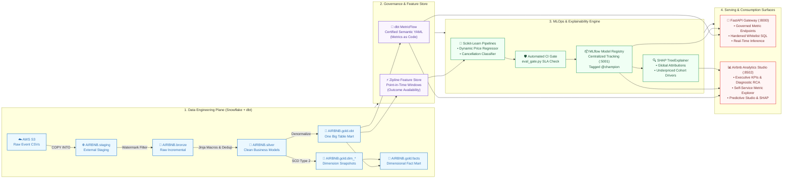

<p align="center">
  
  <h1 align="center">Airbnb Snowflake dbt Pipeline & Semantic Intelligence Platform</h1>
  <p align="center">
    <strong>Enterprise Medallion Data Engineering • MetricFlow Semantic Layer • MLOps & Model Registry • Real-Time Serving</strong>
  </p>
  <p align="center">
    <a href="https://github.com/jimaaa17/airbnb-snowflake-dbt-pipeline/actions/workflows/dbt_ci_cd.yml"></a>
    <a href="https://github.com/jimaaa17/airbnb-snowflake-dbt-pipeline/actions/workflows/ml_and_apps_ci_cd.yml"></a>
    
    
    
    
    
    
  </p>
</p>

---

## 📌 Executive Summary

Modern marketplace platforms require tight alignment between raw analytical warehouses, governed business definitions, and operational machine learning. Without end-to-end governance, organizations encounter three critical failure modes:
1. **Metric Drift**: Business units calculate divergent revenue and conversion ratios across dashboards and APIs.
2. **Temporal Lookahead Leakage**: Predictive pipelines aggregate future cancellation events into historical training snapshots.
3. **Black-Box Pricing Recommendations**: Hosts and operators distrust uncalibrated rate suggestions without explainable drivers.

This repository implements a production-grade, reproducible data intelligence platform resolving these challenges:
* **Trusted Data Foundation**: Staged event streams in **AWS S3** are modeled in **Snowflake** via a **dbt Medallion Architecture** (Bronze → Silver → Gold OBT & SCD Type 2 dimension snapshots) validated by 82 automated reconciliation tests.
* **Consistent Decision Logic**: **dbt MetricFlow** establishes an enterprise Single Source of Truth (SSOT). A **FastAPI Semantic Gateway** consumes this canonical YAML dynamically, compiling parameterized SQL with strict identifier whitelisting.
* **Leakage-Free MLOps**: Inspired by Airbnb's Zipline, a point-in-time feature store enforces outcome-availability timestamps (`CANCELLED_AT < t_predict`). Pipelines train **Gradient Boosting models**, stage `@champion` artifacts in the **MLflow Model Registry**, and validate SLA gates in CI/CD.
* **Operational Explainability**: **SHAP TreeExplainer** decomposes nightly pricing gaps into exact dollar attributions, delivered alongside diagnostic RCA in a 5-page **Streamlit Analytics Studio**.

---

## 💡 Key Demonstrable Outcomes

| Domain | Headline Outcome | Evaluation Cohort & Methodology | Demonstrated Impact & Verification |
| :--- | :--- | :--- | :--- |
| **Data Quality & Governance** | **82 of 82 dbt tests passing** | Full Snowflake Medallion DAG | Reconciles `COUNT(bronze) == COUNT(silver) == COUNT(obt)` with zero join fan-out across all entities. |
| **Metric Consistency** | **Zero cross-surface drift** | Dynamic MetricFlow YAML parsing | Single Source of Truth shared identically between REST endpoints and BI without duplicate definitions. |
| **Pricing Intelligence** | **R² = 0.9438, MAPE = 10.64%** | 300 holdout bookings (EXP-GOLD-001) | Identifies **19.3% underpriced listings**, unlocking an estimated **+$498.45/month per listing** in fair market uplift. |
| **Cancellation Prevention** | **ROC-AUC = 0.5427, PR-AUC = 0.3750** | 300 holdout bookings (EXP-GOLD-001) | Flags **$16,203.45** in high-risk reservations, yielding **$5,671.21 in modeled recoverable revenue** (35% salvage rate) with **23.6d warning**. |
| **Model Interpretability** | **SHAP TreeExplainer attributions** | Tree Shapley decomposition | Isolates marginal dollar drivers (`ACCOMMODATES`, `ROOM_TYPE`, seasonal waves) for underpriced supply. |
| **CI/CD Automation** | **Decoupled quality pipelines** | GitHub Actions workflows | Isolated triggers: dbt warehouse tests run independently from ML regression tests and automated SLA gates. |

> 📊 **Experimental Provenance**: For multi-cohort experimental lineage, warehouse backtests (e.g. EXP-SNOW-002: ROC-AUC 0.8124), and baseline comparisons, see [Model Experimentation & Lineage Specification](docs/EXPERIMENTS.md).

---

## 🏗️ Architecture & Multimodal Serving Flow



> 📖 **Architecture Deep Dive**: Detailed layout and enterprise scaling recommendations (Airflow, Snowpipe, Redis, Kubernetes) are documented in [Platform Architecture & Enterprise Guide](docs/ARCHITECTURE.md).

---

## 🛡️ Governed Semantic Metrics (SSOT)

All metrics queried through the **FastAPI Semantic Gateway** or visualized in the **Analytics Studio** consume the canonical specification in [`airbnb_snowflake_dbt_pipeline/models/gold/semantic_models.yml`](airbnb_snowflake_dbt_pipeline/models/gold/semantic_models.yml):

| Metric Identifier | Display Name | Governed Formula | Accountable Owner | Business Tier |
| :--- | :--- | :--- | :--- | :--- |
| `total_revenue` | Gross Bookings Revenue | `SUM(TOTAL_AMOUNT)` | Finance & Strategy | Tier-1 Executive KPI |
| `booking_confirmation_rate` | Booking Confirmation Rate | `COUNT(confirmed) / COUNT(total) * 100` | Product Growth (SSOT) | Tier-1 Executive KPI |
| `average_booking_value` | Average Booking Value (ABV) | `SUM(TOTAL_AMOUNT) / COUNT(BOOKING_ID)` | Commercial Operations | Tier-1 Commercial |
| `cancellation_rate` | Cancellation Rate | `COUNT(cancelled) / COUNT(total) * 100` | Trust & Safety Operations | Risk & Operations |
| `total_bookings` | Total Reservations Volume | `COUNT(BOOKING_ID)` | Global Operations | Tier-2 Operational |
| `active_listings_count` | Available Supply Count | `COUNT(DISTINCT LISTING_ID)` | Supply & Host Growth | Supply Health |

* **Dynamic Registry Consumption**: `semantic_api/main.py` dynamically ingests MetricFlow YAML at startup, eliminating duplicate dictionary definitions.
* **SQL Injection Hardening**: `compile_semantic_sql()` enforces strict whitelist validation on metrics, dimensions, and time grains, alongside parameter escaping for filter values.

---

## 🤖 Predictive Machine Learning & Evaluation

### 1. Leakage-Free Feature Store (`ZiplineFeatureStore`)
All feature transformations in [`ml/features/transformers.py`](ml/features/transformers.py) and [`ml/features/feature_store.py`](ml/features/feature_store.py) strictly enforce **train-serve parity** and point-in-time correctness:
* **Point-in-Time Outcome Availability**: When computing trailing cancellation features, past reservations are only counted if the cancellation event actually occurred prior to observation time (`CANCELLED_AT < t_predict`).
* **Trigonometric Waves**: Circular calendar features (month, day of week) use sinusoidal projection (`sin`, `cos`), eliminating artificial cliff discontinuities between December and January.
* **Mathematical Derivations**: Complete formulas and division guards are detailed in the [Feature Engineering Specification](docs/FEATURE_ENGINEERING.md).

### 2. Reproducible Holdout Benchmark (EXP-GOLD-001)
Evaluated on a strict chronological temporal split (80% train / 20% holdout test, 300 unseen future reservations):

#### A. Dynamic Nightly Price Regressor
| Model / Pipeline | Architecture | R² Score | MAPE (%) | MAE (USD) | RMSE (USD) | Performance Notes |
| :--- | :--- | :--- | :--- | :--- | :--- | :--- |
| **Naive Median Baseline** | Constant train median ($248.94) | -0.0006 | 53.08% | $90.27 | $109.32 | Zero variance explained. |
| **Linear OLS Baseline** | Univariate OLS (`ACCOMMODATES`) | 0.6871 | 25.14% | $49.60 | $61.13 | Explains capacity; ignores city/seasonality. |
| **Production GBDT (Champion)** | Gradient Boosting (`max_depth=5`) | **0.9438** | **10.64%** | **$20.58** | **$25.92** | **+0.2567 R² lift** over linear baseline; cuts error by **58%**. |

#### B. Booking Cancellation Risk Classifier
| Model / Pipeline | Decision Threshold | Accuracy | Precision | Recall | F₁ Score | ROC-AUC | PR-AUC | Performance Notes |
| :--- | :--- | :--- | :--- | :--- | :--- | :--- | :--- | :--- |
| **Zero-Rule Baseline** | Always predict confirmed (71% prev.) | 71.00% | 0.00% | 0.00% | 0.0000 | 0.5000 | 0.2900 | 0% recall: blind to all cancellations. |
| **Heuristic Cutoff** | Static rule (`lead_time >= 45d`) | 71.00% | 0.00% | 0.00% | 0.0000 | 0.5000 | 0.2900 | Fails to isolate cancellations. |
| **Production GBDT (Champion)** | GBDT (Threshold τ = 0.35) | **68.33%** | **40.00%** | **18.39%** | **0.2520** | **0.5427** | **0.3750** | Catches 18.7% of cancellation dollars 23.6 days in advance. |

### 3. Scientific Discussion: Model Quality vs. Business Utility
* **Discriminative Capability**: An ROC-AUC of 0.5427 and 18.39% recall reflect the inherent challenge of predicting cancellation events *at booking creation* before post-booking shocks occur.
* **Asymmetric Intervention Economics**: Naive baselines achieve 71% accuracy but deliver 0% recall. The GBDT model flags **$16,203.45** in high-risk bookings (16 reservations). Under a conservative 35% rebooking salvage rate with a 23.6-day advance warning window, the model yields **$5,671.21 in modeled recoverable revenue**. Because automated host outreach costs ($2–$5) are negligible compared to unrecovered vacancy loss ($350–$1,000+), targeted recall delivers clear net positive utility.

### 4. MLOps, SHAP Diagnostics & Automated CI SLA Gates
* **MLflow Model Registry**: Centralized tracking (`sqlite:///ml/mlruns.db`) stages vetted pipelines under the `@champion` alias.
* **SHAP TreeExplainer**: Computes exact Shapley values ([`ml/evaluation/shap_diagnostics.py`](ml/evaluation/shap_diagnostics.py)), explaining why underpriced listings warrant rate increases.
* **Automated CI SLA Gate**: [`ml/evaluation/eval_gate.py`](ml/evaluation/eval_gate.py) enforces minimum performance gates in CI (Price R² ≥ 0.85, MAPE ≤ 20.0%, Classifier PR-AUC ≥ 0.25, Accuracy ≥ 60.0%).

---

## 💻 Airbnb Analytics Studio (Streamlit App)

The Analytics Studio (`apps/semantic_bi_app.py`) provides an interactive interface across 5 workspaces:
1. **📈 Executive Overview**: High-level financial KPIs, confirmation ratios, and regional summaries.
2. **🔬 Diagnostic RCA**: Multi-dimensional variance attribution decomposing performance shifts.
3. **⚡ Self-Service Metric Explorer**: Governed slice-and-dice queries compiling audited MetricFlow SQL.
4. **🎯 Predictive ML Studio**: Real-time rate estimator with pricing guardrails, cancellation risk scoring, and SHAP attribution.
5. **📚 Catalog & Lineage Hub**: Certified metric ownership directory, dbt test monitor (82/82 passing), and Medallion DAG.

---

## 🚀 Quickstart & Setup Guide

### 📋 Prerequisites & Least-Privilege Configuration
* **Python 3.12+** & Astral **`uv`** (`curl -LsSf https://astral.sh/uv/install.sh | sh`)
* **Snowflake Account** (Optional for local execution; required for live warehouse transformations).
* **Least-Privilege Role**: When configuring Snowflake, use a dedicated transformation role (`AIRBNB_TRANSFORMER_ROLE`) rather than administrative accounts (`ACCOUNTADMIN`).

```yaml
# ~/.dbt/profiles.yml (For Snowflake Live Mode)
airbnb_snowflake_dbt_pipeline:
  target: dev
  outputs:
    dev:
      type: snowflake
      account: "<account_identifier>"
      user: "<username>"
      password: "<password>"
      role: "AIRBNB_TRANSFORMER_ROLE"
      warehouse: "SNOWFLAKE_LEARNING_WH"
      database: "AIRBNB"
      schema: "dbt_schema"
      threads: 4
```

### 💻 Execution Modes

#### Option A: Zero-Credential Local Reproduction (Instant, No Snowflake Required)
The platform includes deterministic offline fixtures matching `AIRBNB.gold.obt`. Run the entire MLOps, API, and UI stack locally in under 60 seconds:

```bash
# 1. Install locked dependencies
uv sync

# 2. Train ML pipelines, register @champion models in MLflow, and validate CI SLA gate
uv run python ml/train_all.py
uv run python ml/evaluation/eval_gate.py

# 3. Generate SHAP global feature attributions & underpriced cohort plots
uv run python ml/run_shap_analysis.py

# 4. Launch MLflow Experiment Tracking & Model Registry (:5001)
uv run mlflow ui --backend-store-uri sqlite:///ml/mlruns.db --port 5001

# 5. Launch FastAPI Semantic Gateway microservice (:8000)
uv run python -m uvicorn semantic_api.main:app --host 0.0.0.0 --port 8000 --reload

# 6. Launch Airbnb Analytics Studio (:8502)
uv run streamlit run apps/semantic_bi_app.py
```

#### Option B: Full Snowflake Cloud Data Pipeline
```bash
cd airbnb_snowflake_dbt_pipeline
dbt debug && dbt compile
dbt build  # Executes snapshots, incremental models, and 82 reconciliation tests
cd ..
AIRBNB_ML_OFFLINE=0 uv run python ml/train_all.py
uv run streamlit run apps/semantic_bi_app.py
```

---

## 📖 Deep-Dive Documentation

* 📄 **[Platform Architecture & Enterprise Guide](docs/ARCHITECTURE.md)**: Full directory tree, Medallion modeling patterns, and production roadmap.
* 📄 **[Model Experimentation & Lineage Specification](docs/EXPERIMENTS.md)**: Multi-cohort tracking, alternative experiments, and intervention economics.
* 📄 **[Feature Engineering Specification](docs/FEATURE_ENGINEERING.md)**: Point-in-time Zipline logic, cyclical waves, and division guards.
* 📄 **[SME Architecture & Workflow Guide](docs/SEMANTIC_ARCHITECTURE_AND_ML_REPORT.md)**: Detailed analytics engineering workflows and metric drift analysis.
