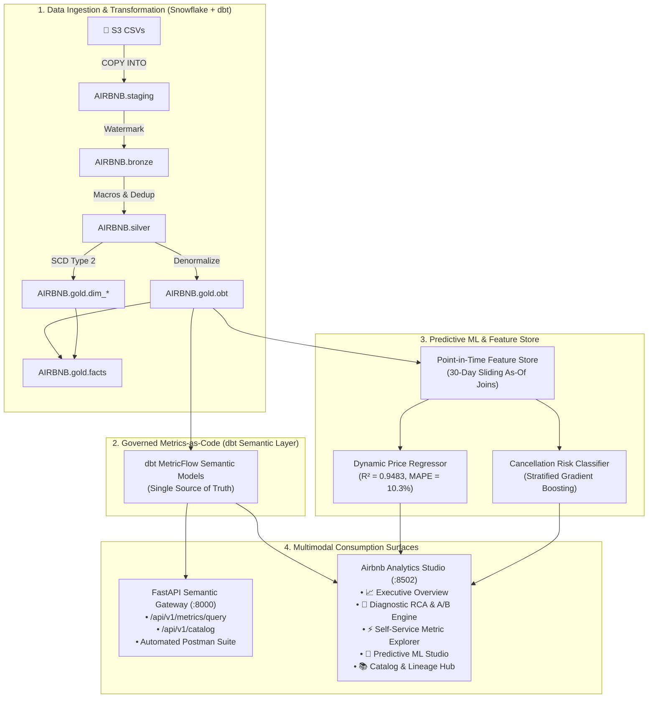

# 🏡 Airbnb Snowflake dbt Pipeline & Semantic Intelligence Platform

An enterprise-grade, end-to-end data transformation, semantic layer, and predictive intelligence platform for Airbnb data on Snowflake. Built using **dbt Medallion Architecture**, **dbt Semantic Layer / MetricFlow**, **FastAPI Semantic Gateway**, **Scikit-Learn ML Pipelines**, and **Airbnb Analytics Studio (Streamlit)**.

---

## 📌 Project Overview

This platform transforms raw marketplace event streams from **AWS S3** into certified **Snowflake** data marts, provides governed **Metrics-as-Code**, and serves real-time predictive microservices and executive decision workflows:

```text
AWS S3 ──► Snowflake Staging ──► Bronze Layer ──► Silver Layer ──► Gold Layer (OBT & SCD2)
                                                                           │
                                                                           ▼
                                                             dbt Semantic Layer (MetricFlow)
                                                                           │
                                       ┌───────────────────────────────────┴───────────────────────────────────┐
                                       ▼                                                                       ▼
                         FastAPI Semantic Gateway (:8000)                                   Airbnb Analytics Studio (:8502)
                         • REST Endpoints & Postman Suite                                   • Executive Overview & KPIs
                         • Governed Dynamic SQL Execution                                   • Diagnostic RCA & A/B Engine
                         • Point-in-Time ML Feature Serving                                 • Predictive Dynamic Pricing & ML
                                                                                            • Self-Service Explorer & Catalog
```

- **Source Ingestion (`AIRBNB.staging`)**: Raw tables loaded from AWS S3 (`listings`, `bookings`, `hosts`) via external stage `COPY INTO`.
- **Bronze Layer (`AIRBNB.bronze`)**: Incremental 1-to-1 schema casting with `CREATED_AT` watermark filtering.
- **Silver Layer (`AIRBNB.silver`)**: Enriched, standardized models utilizing macros (`multiply`, `tag`, `trimmer`) and deduplication on `*_ID`.
- **Gold Marts (`AIRBNB.gold`)**: Denormalized One Big Table (`obt`), dimensional fact table (`facts`), and SCD Type 2 dimension snapshots (`dim_*`).
- **Semantic Layer**: Central Single Source of Truth (SSOT) defined in [`semantic_models.yml`](airbnb_snowflake_dbt_pipeline/models/gold/semantic_models.yml) eliminating cross-departmental metric drift.
- **FastAPI Semantic Gateway**: High-performance REST service exposing governed metric queries and data catalogs.
- **Predictive ML Pipelines**: Chronological As-Of Feature Store (Zipline pattern), Dynamic Price Regressor ($R^2 = 0.9483$), and Booking Cancellation Propensity Classifier.
- **Airbnb Analytics Studio**: Corporate-themed multi-page Streamlit application delivering executive analytics, diagnostic RCA, and interactive ML inference.

---

## 🏗️ Architecture & Multimodal Serving Flow



---

## ✅ Completed Milestones

1. **Modern Python & Tooling Environment**:
   - Managed via Astral **`uv`** on Python 3.12 with deterministic lockfiles.
   - Core libraries: `dbt-core`, `dbt-snowflake`, `fastapi`, `uvicorn`, `streamlit`, `scikit-learn`, `joblib`.
2. **Snowflake Custom Schema Control**:
   - Custom `generate_schema_name` macro ensures exact schema names (`bronze`, `silver`, `gold`) without default target prefixes.
3. **Bronze Layer Ingestion**:
   - Incremental watermark models for `bronze_listings`, `bronze_bookings`, and `bronze_hosts` filtering on `CREATED_AT`.
4. **Silver Layer Cleansing & Business Macros**:
   - Standardized Jinja macros: `multiply` (rounded arithmetic), `tag` (price tier classification), `trimmer` (whitespace sanitization).
   - Merge deduplication on primary keys (`unique_key`).
5. **Gold Marts (One Big Table & SCD Type 2 Star Schema)**:
   - Denormalized wide table `obt` joining bookings, listings, and hosts with **zero fan-out guarantees**.
   - SCD Type 2 dimension snapshots (`dim_bookings`, `dim_listings`, `dim_hosts`) using active sentinel dates (`to_date('9999-12-31')`).
   - Dimensional fact table `facts` joining core transactions to dimension snapshots.
6. **Data Quality & Ingestion Guardrails**:
   - Gatekeeper tests in `tests/source_tests.sql` auditing raw S3 ingestion.
   - Cross-layer reconciliation tests verifying `COUNT(bronze) == COUNT(silver) == COUNT(obt)`. 82 of 82 dbt tests passing in CI/CD.
7. **CI/CD Automation via GitHub Actions**:
   - Pull request validation workflows running `dbt compile` and `dbt test`.
   - Production deployment pipeline running `dbt snapshot` and `dbt build`.
8. **dbt Semantic Layer / MetricFlow Implementation**:
   - Standardized semantic models in [`semantic_models.yml`](airbnb_snowflake_dbt_pipeline/models/gold/semantic_models.yml) eliminating cross-team "Metric Drift".
9. **FastAPI Semantic Gateway**:
   - High-throughput REST microservices at `http://localhost:8000` with Swagger docs (`/docs`) and complete Postman collection.
10. **Predictive Machine Learning Pipelines**:
    - Chronological As-Of Feature Store preventing lookahead data leakage.
    - Gradient Boosting Dynamic Price Regressor ($R^2 = 0.9483$, MAPE $10.34\%$) and Cancellation Classifier.
    - Automated CI/CD evaluation gatekeeper script ([`ml/evaluation/eval_gate.py`](ml/evaluation/eval_gate.py)).
11. **Airbnb Analytics Studio (Streamlit Data App)**:
    - Enterprise BI application at `http://localhost:8502` adhering to Airbnb's corporate design language.

---

## 🛡️ Governed Semantic Metrics (SSOT)

All metrics queried through the API or viewed in the Analytics Studio are certified against governed business logic:

| Metric Identifier | Display Name | Certified Formula | Accountable Owner | Business Tier |
| :--- | :--- | :--- | :--- | :--- |
| `total_revenue` | Gross Bookings Revenue | `SUM(TOTAL_AMOUNT)` | Finance & Strategy | Tier-1 Executive KPI |
| `booking_conversion_rate` | Booking Conversion Rate | `COUNT(confirmed) / COUNT(total) * 100` | Product Growth | Tier-1 Executive KPI |
| `average_booking_value` | Average Booking Value (ABV) | `SUM(TOTAL_AMOUNT) / COUNT(BOOKING_ID)` | Commercial Operations | Tier-1 Commercial |
| `cancellation_rate` | Cancellation Rate | `COUNT(cancelled) / COUNT(total) * 100` | Trust & Safety Operations | Risk & Operations |
| `total_bookings` | Total Reservations Volume | `COUNT(BOOKING_ID)` | Global Operations | Tier-2 Operational |
| `active_listings_count` | Available Supply Count | `COUNT(DISTINCT LISTING_ID)` | Supply & Host Growth | Supply Health |

---

## 🤖 Predictive Machine Learning & Decision Engine

Modeled after **Airbnb's Zipline Feature Store**, the predictive subsystem transforms historical mart records into point-in-time training snapshots and real-time inference microservices.

### 1. Dynamic Fair-Price Regressor
* **Model**: Gradient Boosting Regressor with Scikit-learn Pipeline preprocessors.
* **Accuracy**: **$R^2 = 0.9483$**, **$\text{MAPE} = 10.34\%$**, $\text{MAE} = \$20.54$.
* **Yield Guardrails**: Enforces dynamic pricing guardrails (Floor: **$-15\%$**, Ceiling: **$+25\%$**) to maximize occupancy and defend host revenue yield.

### 2. Booking Cancellation Risk Classifier
* **Model**: Stratified Gradient Boosting Classifier.
* **Intervention Matrix**: Automatically scores new reservations to trigger proactive retention offers (e.g., non-refundable discount locks or flexible rebooking credits) for high-risk bookings.

### 3. Automated Quality Gate (`eval_gate.py`)
All retraining pipelines enforce automated quality gates before serializing artifacts to `ml/artifacts/`:
* Regression Gate: $R^2 \ge 0.85$ and $\text{MAPE} \le 20.0\%$
* Classification Gate: Accuracy $\ge 60.0\%$

---

## 💻 Airbnb Analytics Studio (Streamlit App)

The Analytics Studio (`apps/semantic_bi_app.py`) provides a modular enterprise user interface across 5 distinct operational workspaces:

1. **📈 Executive Overview**: High-level financial KPIs, YoY deltas, and geographic performance cards.
2. **🔬 Diagnostic RCA & A/B Engine**: Multi-dimensional variance attribution and two-sample Z-test statistical significance calculator.
3. **⚡ Self-Service Metric Explorer**: Slice and dice governed metrics with zero raw SQL writing and inspected MetricFlow queries.
4. **🎯 Predictive ML Studio**: Interactive night-rate estimator with yield guardrails and reservation cancellation risk scorer.
5. **📚 Catalog & Lineage Hub**: Certified metric ownership directory, dbt test monitor (82/82 passing), and interactive Medallion DAG.

---

## 📂 Project Directory Structure

```text
Airbnb Snowflake DBT Pipeline/
├── pyproject.toml                                # Project metadata and dependencies (Astral uv)
├── uv.lock                                       # Deterministic lockfile
├── .gitignore                                    # Ignored credentials, venvs, and artifacts
├── README.md                                     # Main project documentation
│
├── airbnb_snowflake_dbt_pipeline/                # Core dbt transformation project
│   ├── dbt_project.yml                           # dbt project configuration & schema mapping
│   ├── macros/                                   # Jinja transformation macros
│   │   ├── generate_schema_name.sql              # Clean bronze/silver/gold schema routing
│   │   ├── multiply.sql                          # Precision multiplication macro
│   │   ├── tag.sql                               # Price tier bucketing macro
│   │   └── trim.sql                              # Whitespace trimming macro
│   ├── models/
│   │   ├── sources/sources.yml                   # Raw staging source definitions
│   │   ├── bronze/                               # Incremental bronze models
│   │   ├── silver/                               # Standardized silver models
│   │   └── gold/                                 # Gold marts, OBT, facts, semantic_models.yml
│   ├── snapshots/                                # SCD Type 2 YAML snapshot definitions
│   └── tests/                                    # Gatekeeper and reconciliation data tests
│
├── semantic_api/                                 # FastAPI Semantic Gateway
│   ├── main.py                                   # REST API endpoints & MetricFlow query router
│   └── airbnb_semantic_layer_postman_collection.json # Automated Postman test suite
│
├── ml/                                           # Predictive Intelligence & Feature Store
│   ├── features/                                 # Feature Store transformers & definitions
│   ├── models/                                   # Gradient Boosting regression & classification
│   ├── evaluation/eval_gate.py                   # Automated CI/CD model evaluation gate
│   ├── inference/service.py                      # Real-time inference microservice
│   ├── train_all.py                              # Master end-to-end training pipeline
│   └── artifacts/                                # Serialized models (git-ignored)
│
├── apps/                                         # Airbnb Analytics Studio (Streamlit App)
│   ├── semantic_bi_app.py                        # Main multi-page navigation shell
│   ├── components/                               # Reusable UI components, header & theme
│   ├── assets/                                   # Authentic Airbnb Bélo vector & PNG branding
│   └── views/                                    # 5 dedicated workspace modules
│       ├── executive_overview.py
│       ├── diagnostic_rca.py
│       ├── metric_explorer.py
│       ├── predictive_studio.py
│       └── catalog_hub.py
│
└── docs/                                         # In-depth architectural & business reports
    ├── SEMANTIC_ARCHITECTURE_AND_ML_REPORT.md    # SME architectural guide & workflows
    └── semantic_layer_and_predictive_roadmap.md  # Engineering roadmap & design patterns
```

---

## 🚀 Quickstart & Execution Commands

### 1. Install Environment
```bash
uv sync
source .venv/bin/activate
```

### 2. Run dbt Pipeline (Snowflake)
```bash
cd airbnb_snowflake_dbt_pipeline
dbt debug                                         # Verify Snowflake connection
dbt build                                         # Run snapshots, models, and tests in DAG order
cd ..
```

### 3. Launch FastAPI Semantic Gateway
```bash
uv run python -m uvicorn semantic_api.main:app --host 0.0.0.0 --port 8000 --reload
# Access Interactive Swagger Docs: http://localhost:8000/docs
```

### 4. Train Predictive Machine Learning Models
```bash
uv run python ml/train_all.py
# Runs Feature Store aggregations, model training, and passes eval_gate.py
```

### 5. Launch Airbnb Analytics Studio (Streamlit)
```bash
uv run streamlit run apps/semantic_bi_app.py
# Access Web Application: http://localhost:8502
```

---

## 📖 Additional Documentation & Executive Reports

* 📄 **[SME Architecture & Workflow Guide](docs/SEMANTIC_ARCHITECTURE_AND_ML_REPORT.md)**: Detailed step-by-step SME workflows, mathematical formulations, and metric drift analysis.
* 📄 **[Semantic Layer & Predictive Roadmap](docs/semantic_layer_and_predictive_roadmap.md)**: Engineering design patterns, Zipline feature store architecture, and Stage 4 Agentic AI vision.
* 📄 **[Business Value & ROI Report](file:///Users/jimitnaik/.gemini/antigravity-ide/brain/668df43e-3a1c-4c68-97e8-dac55235cc48/airbnb_analytics_studio_business_value_report.md)**: Executive translation of analytics insights, commercial impact, and ROI model.
