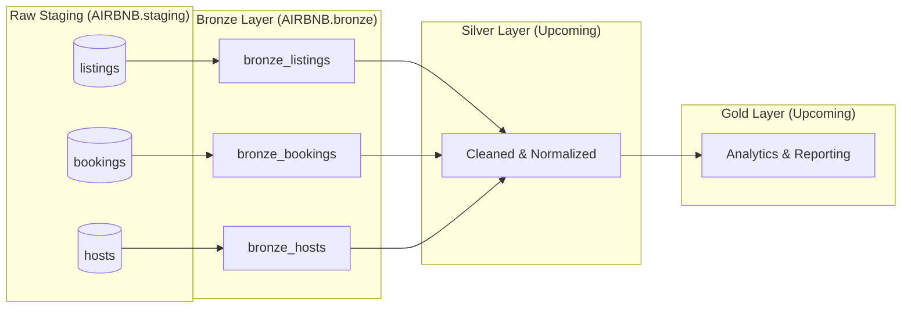

# 🏡 Airbnb Snowflake dbt Pipeline

An end-to-end data transformation and analytics pipeline for Airbnb data on Snowflake, modeled using **dbt** with a **Medallion (Bronze → Silver → Gold) Architecture**.

---

## 📌 Project Overview

This project ingests raw Airbnb data from a staging layer and processes it through a multi-tier data warehouse architecture in Snowflake:
- **Raw / Staging**: External data ingestion into raw Snowflake tables (`listings`, `bookings`, `hosts`).
- **Bronze Layer (Completed)**: Raw ingestion models with schema isolation and incremental loading capabilities.
- **Silver Layer (Upcoming)**: Cleaned, validated, and normalized data models applying transformation macros.
- **Gold Layer (Upcoming)**: Fact and dimension analytical models ready for BI reporting and metrics.

---

## 🏗️ Architecture & Progress (Up to Today)



### ✅ Completed Work:
1. **Modern Python & Tooling Environment**:
   - Packaged and managed using **Astral `uv`** on Python 3.12.
   - Core libraries: `dbt-core (v1.12.5)`, `dbt-snowflake (v1.12.1)`, `boto3`.
2. **Snowflake Integration**:
   - Configured dbt Snowflake adapter connected to database `AIRBNB` and warehouse `SNOWFLAKE_LEARNING_WH`.
3. **Custom Schema Control**:
   - Custom `generate_schema_name` macro implemented to route tables directly into their dedicated schemas (`bronze`, `silver`, `gold`) without default schema prefixes.
4. **Source Declarations**:
   - Structured `sources.yml` mapping `AIRBNB.staging` tables (`listings`, `bookings`, `hosts`).
5. **Bronze Layer Ingestion**:
   - Models created for `bronze_listings`, `bronze_bookings`, and `bronze_hosts`.
   - Materialization configured as `incremental` utilizing dbt's `is_incremental()` macro with timestamp watermarking on `CREATED_AT`.
6. **IDE & Extension Tooling**:
   - Configured `.vscode/settings.json` for dbt Power User extension compatibility with local `.venv`.

---

## 📂 Project Structure

```text
Airbnb Snowflake DBT Pipeline/
├── pyproject.toml                         # Project metadata and dependencies (managed via uv)
├── uv.lock                                # Deterministic lockfile
├── .gitignore                             # Ignored credentials, venvs, and build artifacts
├── README.md                              # Project documentation
│
└── airbnb_snowflake_dbt_pipeline/        # Core dbt project
    ├── dbt_project.yml                    # dbt project configuration & schema mapping
    ├── profiles.yml                       # Connection profile (git-ignored for security)
    │
    ├── macros/
    │   └── generate_schema_name.sql       # Custom macro for clean bronze/silver/gold schemas
    │
    ├── models/
    │   ├── sources/
    │   │   └── sources.yml                # Raw staging source definitions
    │   └── bronze/                        # Bronze layer models (incremental)
    │       ├── bronze_listings.sql
    │       ├── bronze_bookings.sql
    │       ├── bronze_hosts.sql
    │       └── properties.yml
    │
    ├── analyses/                          # Ad-hoc exploratory queries & Jinja experiments
    ├── seeds/                             # CSV seed data
    ├── snapshots/                         # Type-2 SCD snapshots
    └── tests/                             # Custom singular and generic data tests
```

---

## 🚀 Getting Started

### 1. Prerequisites
- [uv](https://docs.astral.sh/uv/) installed: `brew install uv`
- Access to a Snowflake account with appropriate database and warehouse privileges.

### 2. Install Dependencies
```bash
uv sync
source .venv/bin/activate
```

### 3. Configure Connection Profile
Ensure your `~/.dbt/profiles.yml` or `airbnb_snowflake_dbt_pipeline/profiles.yml` is configured:

```yaml
airbnb_snowflake_dbt_pipeline:
  target: dev
  outputs:
    dev:
      type: snowflake
      account: <YOUR_SNOWFLAKE_ACCOUNT>
      user: <YOUR_USERNAME>
      password: <YOUR_PASSWORD>   # Or use private_key_path for key-pair auth
      role: ACCOUNTADMIN
      warehouse: SNOWFLAKE_LEARNING_WH
      database: AIRBNB
      schema: dbt_schema
      threads: 1
```

### 4. Validate Setup
```bash
cd airbnb_snowflake_dbt_pipeline
dbt debug
```

### 5. Compile and Run Bronze Models
```bash
# Compile and check DAG
dbt compile

# Run all Bronze models
dbt run --select bronze
```

---

## 🗺️ Next Steps
- [ ] Develop **Silver Layer**: Data cleansing, handling nulls, type-casting, and business transformations.
- [ ] Create reusable Jinja macros for currency formatting, date parsing, and standardization.
- [ ] Implement data quality tests (uniqueness, not-null, referential integrity).
- [ ] Build **Gold Layer**: Dimensional models (fact bookings, dim listings, dim hosts).
