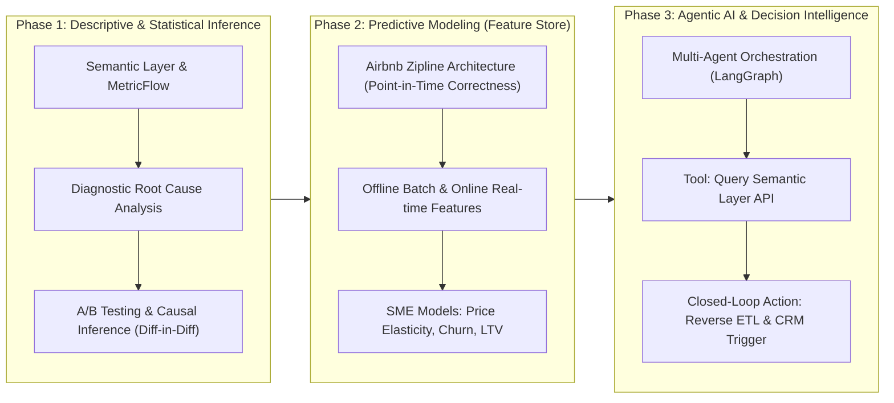

# Semantic Layer, Data Catalog & Predictive Analytics Roadmap

**Enterprise Architecture & Engineering Guide for Airbnb Analytics & Data Science**  
*Audience:* Data Engineers, Analytics Engineers, Data Scientists, and SMEs  
*Target Stack:* dbt Core (Semantic Layer / MetricFlow), Snowflake, FastAPI, Streamlit, Feast / Zipline Feature Store, scikit-learn, MLflow, LangGraph  

---

## 🏛️ 1.0 Executive Overview: The Paradigm Shift

### The Anti-Pattern: Metric Drift in Legacy BI (Tableau / Power BI)
In traditional data organizations, business intelligence relies on analysts writing raw SQL or dragging-and-dropping formulas inside proprietary BI tools like Tableau or Power BI. This causes **Metric Drift**:
* **Marketing** defines *Booking Conversion* as:  
  $$\text{Conversion} = \frac{\text{Confirmed Bookings}}{\text{Unique Visitor Sessions}}$$
* **Product** defines *Booking Conversion* as:  
  $$\text{Conversion} = \frac{\text{Confirmed Bookings}}{\text{Total Booking Inquiries}}$$
* **Finance** defines *Booking Conversion* as:  
  $$\text{Conversion} = \frac{\text{Settled Financial Transactions}}{\text{Gross Reservation Requests}}$$

When metrics change or disagree across executive presentations, data teams spend 80% of their time reconciling numbers rather than producing actionable insights.

```
[ Traditional BI: Fragile & Dispersed ]
Raw Tables ──► Analyst A (Custom SQL in Tableau)  ──► "Conversion = 84%"
Raw Tables ──► Analyst B (DAX in Power BI)        ──► "Conversion = 71%"  (Metric Drift!)
Raw Tables ──► Data Scientist (Jupyter Notebook) ──► "Conversion = 79%"

[ Modern Semantic Layer: Governed Metrics as Code ]
Snowflake Gold Marts ──► dbt / MetricFlow (Semantic Layer) 
                              │ (Single Source of Truth)
                              ├──► FastAPI Gateway (Postman / REST)
                              ├──► Streamlit Python Data Apps (Open-Source BI)
                              ├──► Feature Store (Point-in-Time Features)
                              └──► Agentic LLM Tools (Governed SQL Generation)
```

---

## 📐 2.0 Semantic Layer & Metrics as Code Implementation

The Semantic Layer is defined directly in version control at [`models/gold/semantic_models.yml`](file:///Users/jimitnaik/Documents/Projects/Airbnb%20Snowflake%20DBT%20Pipeline/airbnb_snowflake_dbt_pipeline/models/gold/semantic_models.yml).

### 2.1 Entities, Dimensions, and Measures
* **Entities**:
  - `booking_id`: Primary transactional grain.
  - `listing_id`: Supply entity foreign key.
  - `host_id`: Host entity foreign key.
* **Dimensions**:
  - `booking_date`: Time dimension (supports day, week, month, quarter, year grains).
  - Categorical: `city`, `country`, `property_type`, `room_type`, `price_tier`, `is_superhost`, `response_rate_band`.
* **Measures & Aggregations**:
  - `total_booking_revenue` = `SUM(total_amount)`
  - `booking_count` = `COUNT(booking_id)`
  - `confirmed_booking_count` = `COUNT(CASE WHEN booking_status = 'confirmed' THEN booking_id END)`
  - `cancelled_booking_count` = `COUNT(CASE WHEN booking_status = 'cancelled' THEN booking_id END)`
  - `distinct_listings` = `COUNT(DISTINCT listing_id)`

### 2.2 Governed Metrics (Single Source of Truth)
| Metric Name | Display Label | Type | Calculation / Formula | Accountable Owner |
| :--- | :--- | :--- | :--- | :--- |
| `total_revenue` | Total Revenue ($) | Simple | `SUM(total_amount)` | Finance |
| `total_bookings` | Total Bookings | Simple | `COUNT(booking_id)` | Operations |
| `booking_conversion_rate` | Booking Conversion Rate | **Ratio** | `confirmed_bookings / total_bookings` | Product Growth (SSOT) |
| `cancellation_rate` | Cancellation Rate | **Ratio** | `cancelled_bookings / total_bookings` | Trust & Safety |
| `average_booking_value` | Average Booking Value (ABV) | **Ratio** | `total_revenue / total_bookings` | Finance |
| `active_listings_count` | Active Listings Count | Simple | `COUNT(DISTINCT listing_id)` | Supply Growth |
| `revenue_per_active_listing`| Revenue Per Active Listing | **Ratio** | `total_revenue / active_listings_count` | Supply Growth |

---

## 🔌 3.0 Open-Source Serving Stack (FastAPI & Streamlit)

Instead of proprietary BI software licenses, the serving tier is built using modern open-source Python frameworks:

### 3.1 FastAPI Semantic Gateway (`semantic_api/main.py`)
Provides a RESTful API layer that translates high-level metric requests into governed Snowflake SQL:
* `GET /api/v1/catalog`: Returns all registered metrics, entities, and dimensions.
* `GET /api/v1/catalog/metrics/{name}`: Inspects individual metric formulas, owners, and tiers.
* `GET /api/v1/catalog/lineage`: Returns Medallion lineage and data test status (82/82 passing).
* `POST /api/v1/metrics/query`: Dynamic semantic query compiler:
  ```json
  {
    "metrics": ["total_revenue", "booking_conversion_rate"],
    "dimensions": ["city"],
    "time_dimension": "booking_date",
    "time_grain": "month",
    "filters": {"country": "USA"}
  }
  ```
* **Postman Collection**: Readily available at [`semantic_api/airbnb_semantic_layer_postman_collection.json`](file:///Users/jimitnaik/Documents/Projects/Airbnb%20Snowflake%20DBT%20Pipeline/semantic_api/airbnb_semantic_layer_postman_collection.json).

### 3.2 Streamlit Python Data App (`apps/semantic_bi_app.py`)
An interactive executive and operational application with four dedicated workspaces:
1. **Executive KPI Dashboard**: Live tracking of Gross Revenue, Conversion Rate, ABV, and Active Listings with dimensional filtering.
2. **Diagnostic RCA & A/B Statistical Inference**: Automated variance decomposition across dimensions and two-proportion Z-test experimentation calculator.
3. **Self-Service Semantic Query Builder**: Dropdown metric/dimension selector with transparent SQL generation and CSV exports.
4. **Data Catalog & Governance Hub**: Lineage graph, metric dictionary, and data quality test badges.

---

## 🗺️ 4.0 The Phased Roadmap: From Dashboards to Agentic AI



---

### Phase 1: From Visualization to Statistical Inference
Dashboards tell SMEs *what* changed; statistical inference tells them *why* it changed and whether the change is statistically significant.

1. **Establish the Semantic Query Layer**:
   - Centralize metric logic in dbt/MetricFlow. If an SME asks, *"Why did booking conversion drop in Miami?"*, the definition of conversion is mathematically fixed.
2. **Automated Root Cause Analysis (Diagnostic Analytics)**:
   - Move beyond static charts by building automated anomaly detection.
   - When a metric experiences a significant shift, the diagnostic module decomposes the variance across dimension combinations (`city`, `property_type`, `price_tier`) to isolate the root driver (e.g., *"The drop is driven 82% by private rooms in London after fee updates"*).
3. **A/B Testing Infrastructure**:
   - Standardized statistical power calculation before launching treatments (search ranking algorithms, host badges).
   - Post-experiment causal inference (Difference-in-Differences, Synthetic Controls) to measure true incremental uplift without confounding variables.

---

### Phase 2: Predictive Modeling & Feature Engineering (The Airbnb Zipline Paradigm)
*Reference: [Airbnb Engineering: Zipline — Internal ML Data Management Platform](https://www.youtube.com/watch?v=Tg5VEMEsC-0)*

Predictive machine learning requires engineered features that are strictly point-in-time correct. In Airbnb's architecture, this led to the creation of **Zipline**:

```
[ Why Traditional Data Warehouses Fail for ML ]
Problem: "Data Leakage" & "Time Travel"
If training a model on booking cancellations in June 2023, you cannot use a host's current 
rating from today. You must know the host's rating *as of June 2023*.

[ Zipline / Modern Feature Store Solution ]
1. Point-in-Time Joins (As-Of Joins):
   Merges observation events with feature values at the exact timestamp of the event.
2. Dual-Serving Consistency:
   - Batch Serving (Snowflake): Used by scikit-learn / XGBoost for historical training.
   - Low-Latency Online Serving (Redis / Feature Store): Used by real-time production inference.
```

#### Mapping dbt Semantic Models to Features
| Feature Name | Source Layer | Feature Description | Time Window |
| :--- | :--- | :--- | :--- |
| `listing_trailing_30d_bookings` | `AIRBNB.gold.obt` | Number of bookings in past 30 days | 30 Days Sliding |
| `listing_cancellation_rate_60d` | `AIRBNB.gold.obt` | Trailing cancellation percentage | 60 Days Sliding |
| `host_response_rate_current` | `AIRBNB.gold.dim_hosts` | Point-in-time SCD2 host response score | Point-in-Time |
| `market_price_percentile` | `AIRBNB.gold.facts` | Listing price relative to city median | Point-in-Time |

#### High-Value SME Predictive Use Cases
1. **Dynamic Price Elasticity Guardrails**:
   - Predicts booking probability across varying price points based on lead time, seasonality, and amenities.
   - Provides hosts with recommended minimum and maximum price guardrails.
2. **Host Churn Propensity Model**:
   - Predicts which high-value hosts are at risk of leaving the platform based on calendar block rates, booking velocity declines, and message response latency.
   - Powers proactive intervention by Host Account Managers.
3. **Guest Lifetime Value (LTV) Forecasting**:
   - Predicts 12-month forward gross booking spend based on first-trip characteristics.

---

### Phase 3: Moving to Agentic AI and Decision Intelligence
The final frontier is moving from passive predictive scores to active, autonomous **Agentic AI systems**:

```
[ Agentic Analytical Workflow: LangGraph Orchestration ]

[ User / SME Natural Language Question ]
       │
       ▼
┌───────────────────────────────────────────────┐
│ Agent 1: Data Analyst (Semantic Translator)  │
│ - Reads question: "Why did revenue drop?"     │
│ - Calls Tool: GET /api/v1/catalog/metrics     │
│ - Calls Tool: POST /api/v1/metrics/query      │
│   (Never writes raw SQL; queries Semantic API)│
└──────────────────────┬────────────────────────┘
                       │
                       ▼
┌───────────────────────────────────────────────┐
│ Agent 2: Statistician (Causal Reasoner)       │
│ - Runs variance decomposition across dims     │
│ - Checks statistical significance (p-value)   │
│ - Formulates hypothesis                       │
└──────────────────────┬────────────────────────┘
                       │
                       ▼
┌───────────────────────────────────────────────┐
│ Agent 3: Executive Reporter & Action Agent   │
│ - Synthesizes actionable narrative report     │
│ - Triggers CRM / Reverse ETL action           │
│   (e.g., target marketing campaign to hosts)  │
└───────────────────────────────────────────────┘
```

1. **Insight Mining from Unstructured Data**:
   - Clustering guest reviews and support tickets via LLM embeddings to identify latent amenities or dissatisfaction points.
2. **Semantic-First Query Execution**:
   - LLMs are prohibited from hallucinating SQL queries against physical raw tables.
   - The LLM is provided tools that call the **FastAPI Semantic Gateway**. The agent simply selects `{"metric": "booking_conversion_rate", "dimensions": ["city"]}`, guaranteeing 100% governed calculations.
3. **Connecting Insights to Automated Action**:
   - When models detect supply-demand imbalances in a market, the agent autonomously triggers a targeted marketing campaign in the CRM via Reverse ETL.

---

## 🚀 5.0 Running the Local Serving Stack

### 1. Launch the FastAPI Semantic Gateway
```bash
uv run python -m uvicorn semantic_api.main:app --host 0.0.0.0 --port 8000 --reload
```
* **Swagger UI:** [http://localhost:8000/docs](http://localhost:8000/docs)
* **API Documentation:** [http://localhost:8000/redoc](http://localhost:8000/redoc)

### 2. Launch the Streamlit Python Data App
```bash
uv run streamlit run apps/semantic_bi_app.py
```
* **Interactive Dashboard:** [http://localhost:8501](http://localhost:8501)
